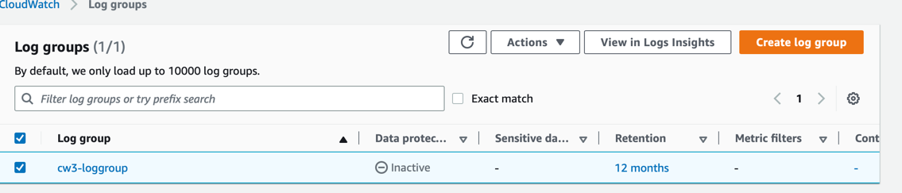
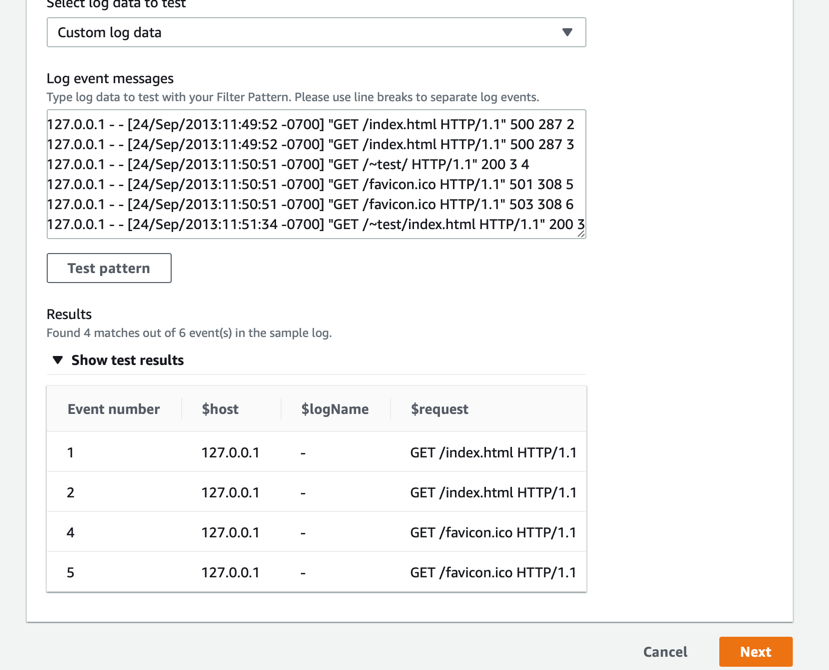
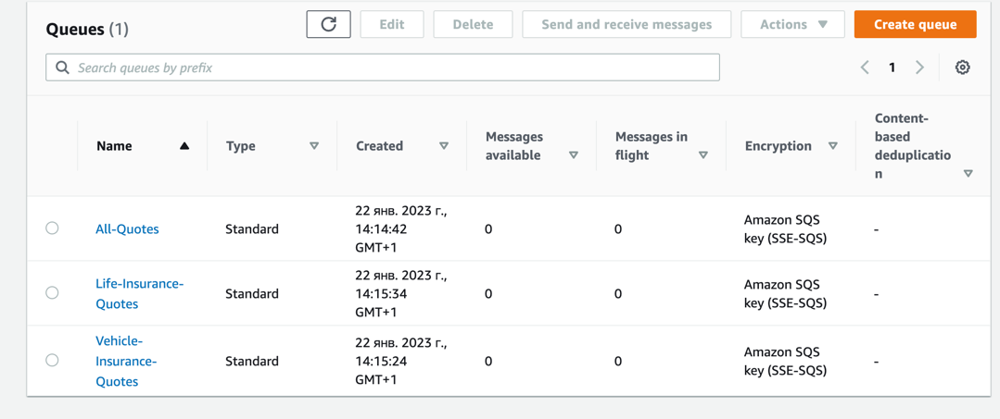

# CloudWatch, SNS, SQS
## Task 1 - Using CloudWatch for Resource Monitoring, Create CloudWatch Alarms and Dashboards
1. Create a new EC2 instance;
2. Create a topic in SNS

3. Subscribe to this new topic via email, confirm the subscription in letter

4. Check the EC2 CPU Utilization in CloudWatch

5. Create a new CloudWatch Alarm (alert if the CPU utilization >= 20%)

6. Install stress test packages in EC2 Console:
```shell
sudo amazon-linux-extras install epel -y
sudo yum install stress -y
```
Run stress test
```shell
stress -c 4
```
7. Check the email box. Message from Alarm here:

8. Check the Alarm Graph:

9. Create a Dashboard

10. Remove Alarm, Dashboard, EC2 Instance and SNS topic

## Task 2 - Install CloudWatch Logs Agent on EC2 Instance and View CloudWatch Metrics
1. Create a new EC2 instance;
2. We should create a new role based on `CloudWatchAgentServerRole` police and update EC2 roles with this a new one;
3. Install CloudWatch agent on EC2 instance
```shell
sudo yum install amazon-cloudwatch-agent
```
4. Let's create a configuration file:
```shell
sudo /opt/aws/amazon-cloudwatch-agent/bin/config.json
```
And paste to this file:
```json
{
  "agent": {
    "metrics_collection_interval": 60,
    "run_as_user": "cwagent"
  },
  "metrics": {
    "append_dimensions": {
      "AutoScalingGroupName": "${aws:AutoScalingGroupName}",
      "ImageId": "${aws:ImageId}",
      "InstanceId": "${aws:InstanceId}",
      "InstanceType": "${aws:InstanceType}"
    },
    "metrics_collected": {
      "disk": {
        "measurement": [
          "used_percent"
        ],
        "metrics_collection_interval": 60,
        "resources": [
          "*"
        ]
      },
      "mem": {
        "measurement": [
          "mem_used_percent"
        ],
        "metrics_collection_interval": 60
      }
    }
  }
}
```
And start the CloudWatch Agent:
```shell
sudo /opt/aws/amazon-cloudwatch-agent/bin/amazon-cloudwatch-agent-ctl -a fetch-config -m ec2 -c file:/opt/aws/amazon-cloudwatch-agent/bin/config.json -s
```
BUT. Here we can use another way to configure:
```shell
sudo /opt/aws/amazon-cloudwatch-agent/bin/amazon-cloudwatch-agent-config-wizard
```
And after all settings we can start the Agent using command:
```shell
sudo /opt/aws/amazon-cloudwatch-agent/bin/amazon-cloudwatch-agent-ctl -a fetch-config -m ec2 -c ssm:AmazonCloudWatch-linux -s
```
5. Metrics from this CloudWatch Agent:


## Task 3 - Create an Alarm Using a Metric Filter
1. Create a new Topic:

2. Create a new Subscription with email and topic from the last step:

3. Create a new Logging Group with 12 months retention period

4. Inside this group - create a new metric filter with the name `http-5xx-metric` and pattern - `[host, logName, user, timestamp, request, statusCode=5*, size]`. 
We can test it using the strings from task
```text
127.0.0.1 - - [24/Sep/2013:11:49:52 -0700] "GET /index.html HTTP/1.1" 500 287 2
127.0.0.1 - - [24/Sep/2013:11:49:52 -0700] "GET /index.html HTTP/1.1" 500 287 3
127.0.0.1 - - [24/Sep/2013:11:50:51 -0700] "GET /~test/ HTTP/1.1" 200 3 4
127.0.0.1 - - [24/Sep/2013:11:50:51 -0700] "GET /favicon.ico HTTP/1.1" 501 308 5
127.0.0.1 - - [24/Sep/2013:11:50:51 -0700] "GET /favicon.ico HTTP/1.1" 503 308 6
127.0.0.1 - - [24/Sep/2013:11:51:34 -0700] "GET /~test/index.html HTTP/1.1" 200 3
```


5. Let's create Alarm using previous metric


6. Let's trigger Alarm in the AWS Console
```shell
aws cloudwatch set-alarm-state --alarm-name='5xx-alarm' --state-reason "Testing the Amazon Cloudwatch alarm" --state-value ALARM
```
After that publish the message in the topic
7. Received two messages: one from Alarm and one from Topic Publication
8. Terminate all stuff

# Task 4 - Introduction to Simple Queuing Service
1. Create Standard and FIFO queues


Some explanation:
1. Visibility Timeout - While a consumer is processing a message in the queue, SQS temporary hides the message  
from other consumers. Default is 30 sec;
2. Long Polling - Long polling helps reduce your cost of using Amazon SQS by reducing the number of empty responses 
when there are no messages available to return in reply to a ReceiveMessage request sent to an Amazon 
SQS queue and eliminating false empty responses. Between 0 (Short Polling) and 20 sec (long polling);
3. Delay Queue - any messages that you send to the queue remain invisible to consumers for the duration of  
the delay period. Between 0 and 15 minutes;
4. Purge Queue - remove all messages from queue.

# Task 5 - Creating CloudWatch Logs for SQS by Triggering a Lambda function
1. Create a new SQS for this task;
2. Create a simple Lambda from Python 3.9 template;

3. Create a new Role for Lambda with Full SQS Permissions and also Basic Lambda Permissions. And add this role to Lambda in Configuration/Permissions:

4. Add trigger SQL to Lambda:

5. Run the code and check logs:

6. The main test - send the message to SQS and check the logs after lambda was triggered


7. Remove all stuff.

# Task 6 - Add SNS subscription filtering for SQS
Use this article (https://aws.amazon.com/ru/getting-started/hands-on/filter-messages-published-to-topics/)
1. Create a SNS topic with the name `Insurance-Quote-Requests`

2. Create three standard SQS: `Vehicle-Insurance-Quotes`, `Life-Insurance-Quotes` and `All-Quotes`

3. From all these three SQS let's subscribe to the SNS topic from 1 step:

4. For `Vehicle-Insurance-Quotes` and `Life-Insurance-Quotes` let's update subscription policy:

5. Publish some messages with different Message attributes to SNS topic:

6. Check all SQSs. The filter works fine:


7. Remove all stuff