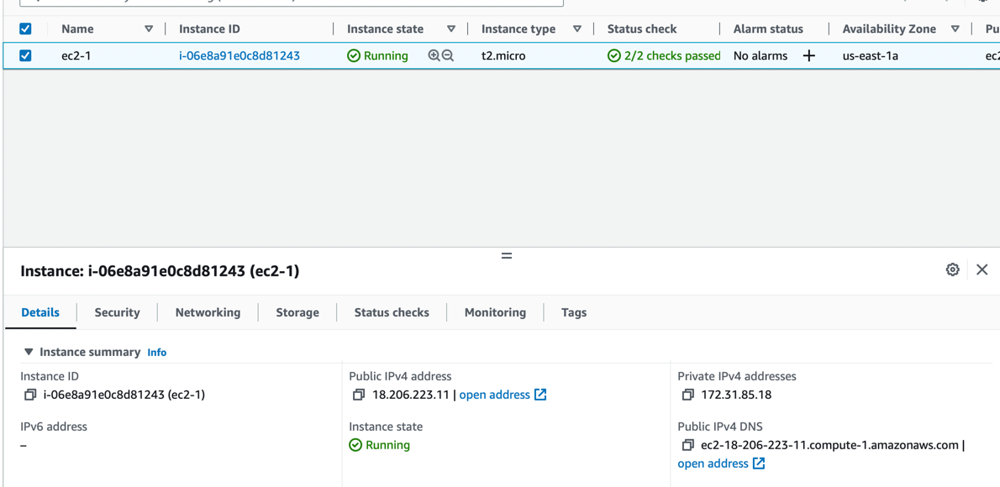
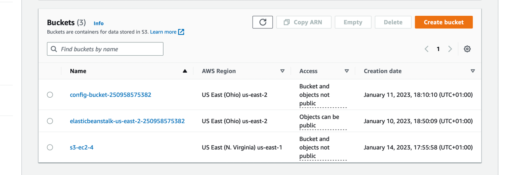
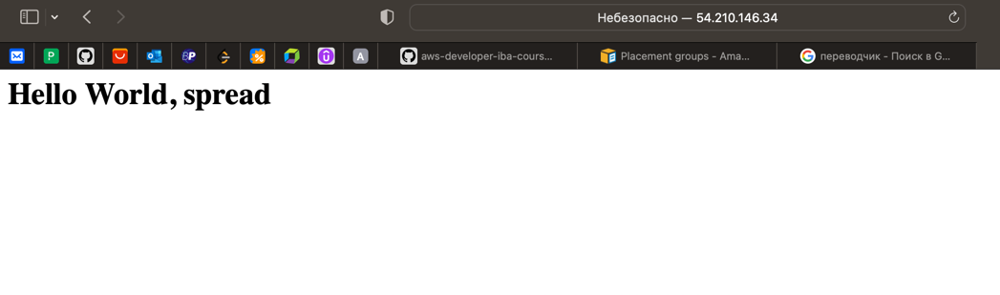

# EC2
## Task 1 - Launch internet accessible web server using ec2 with manual setup
1. Create a simple instance of EC2 without userdata;

2. Open the console of this instance:

3. Run some commands here:
```shell
sudo yum update -y
sudo yum install -y httpd
sudo systemctl start httpd
sudo systemctl enable httpd
sudo nano /var/www/html/index.html
```
In file paste this code:
```html
<h1>Hello World ES2-1</h1>
```
4. Check the result using public ip address:

5. Terminate the instance.

## Task 2 - Setup EC2 using userdata
1. Create an instance of EC2 with preload userdata:
```shell
#!/bin/bash
sudo yum update -y
sudo yum install -y httpd
sudo systemctl start httpd
sudo systemctl enable httpd
echo '<h1>Hello World EC2-2</h1>' | sudo tee /var/www/html/index.html
```

2. Check the result using public ip:

3. Terminate the instance.

## Task 3 - Setup EC2 using userdata and create a static public ip address.
1. Create an instance of EC2 with preload userdata:
```shell
#!/bin/bash
sudo yum update -y
sudo yum install -y httpd
sudo systemctl start httpd
sudo systemctl enable httpd
echo '<h1>Hello World EC2-2</h1>' | sudo tee /var/www/html/index.html
```

2. Create an Elastic IP:

3. Associate Elastic IP with EC2 instance from previous step;
4. Check the Elastic IP in browser -> reboot instance -> check again THE SAME IP -> works!
5. Terminate the instance.

## Task 4 - Create an ec2 server and test access for S3.
1. Create a bucket with default settings in S3:

2. Try to check the list of available buckets in CloudShell:
```shell
aws s3 ls
```

3. Create the EC2 instance from 2 task.
4. Try check the same buckets from EC2 instance shell. Error

5. Create new Role in IAM-Roles with `AmazonS3ReadOnlyAccess` policy

6. Attach the new IBM role to a specific EC2 instance:

7. Try to check again the list of S3 buckets from EC2 shell - works!:

8. Wait a bit before terminating. Will terminate after some steps in task 5.

## Task 5 - Launch template
1. Let's create template from EC2 `ec2-4` instance from previous task. After that we can terminate the instance:

2. Next let's create an instance from template:

3. Check the public ip of this instance:

4. Terminate the instance.

## Task 6 - Setup highly available server stack using ALB + Target Group
1. Create new security group for EC2 instances - `EC2-target`

2. Create two new EC instances with new security group `EC2-target` and this userdata
```shell
#!/bin/bash
sudo yum update -y
sudo yum install -y httpd
sudo systemctl start httpd
sudo systemctl enable httpd
echo '<h1>Hello World from First|Second instance</h1>' | sudo tee /var/www/html/index.html
```

3. Create a target group with 2 EC2 instances:

4. Create a new security group for ALB - `ALB-EC2-6`

5. Create ALB

6. Check the DNS of balancer - works


7. To prevent connection directly to EC2 instances - let's update `EC2-target` security group

8. Now if we connect directly to EC2 - infinite loading

9. Terminate ALB and all instances

## Task 7 - Spot Fleet
1. Create template using t2.micro, default userdata with httpd and index.html:

2. Create a new target group:

3. Create a new ALB with the target group from previous step:

4. Create ASG using template and ALB from previous steps:

5. Check instance using ALB DNS:

6. Create a spot request using template

Instance:

7. Check using instance public ip

8. Remove all stuff!

## Task 8 - Create AMI with httpd server
1. Create a new EC2 instance with html page and httpd. Will use from template (from 5 task). Check the public ip:

2. Create an AMI from this EC2 instance:

3. Remove the current EC2 instance and create a new one using AMI image:

4. Check the result using public ip:

5. Remove AMI

## Task 9 - Launch Configuration and Autoscaling group
1. Create a new AMI from basic EC2 instance (httpd and html page):

2. Create new target group:

3. Create new ALB with target group from previous step:

4. Create new launch template using AMI from step 1:

5. Create an ASG using our template, balancer and target group. Set min - 1, des - 2, max - 3


6. Remove ASG, ALB, AMI and instances

## Task 10 - EBS and ec2
1. Create a new EC2 instance (f.e. from template):

2. Create a new EBS volume in the same AZ as instance:

3. Attach volume to our EC2 instance:

The result is here:

4. We should make EBS available for use:
```shell
sudo mkfs -t xfs /dev/sdf #create a file system on the volume. ATTENTION!! If we know that the volume is empty
sudo mkdir /data
sudo mount /dev/sdf /data #mount the volume at the directory you created in the previous step
```
5. Add `test.txt` file to our volume:
```shell
echo 'Put some text to the file' | sudo tee text.txt
```

6. After that we should detach EBS. First of all we should umount it from instance:
```shell
sudo umount -d /dev/sdf
```
7. Create a new instance with name `ec-2-10`

8. Detach volume from first EC2 instance and attach to the second one:

9. Connect to the second instance and mount the EBS:
```shell
sudo mkdir /data
sudo mount /dev/sdf /data
```

10. Terminate all instances and extra volume.

## Task 11 - EFS and ec2
1. Create an EFS for several regions (because I want to check some EC2 instances with the same file storage).
A little remark. I created also new security group as in course. Attention. Don't forget to add new rule for SSH 22 port! 


2. Create two instances (one in A and one in B AZ) and attach the new file storage with the path `/mnt/efs/fs1`

3. (a little remark. I didn't understand what does it mean - 'upload'. It's just a simple creating a file or we should
upload file to EC2 from our laptop storage)
I tried to upload using as usual `scp` but `ec2-user` doesn't have enough permissions. `root` user is disable by Amazon.
```shell
scp /Users/pavellahovskij/test_file.txt -i EC2-task.pem ec2-user@44.204.18.36:/mnt/efs/fs1/test_file.txt
```
So. Only simple creation

4. This file also available from the second instance in another AZ

5. Terminate instances and file storage.

## Task 12 - EBS and EC2
1. Create aa instance with default and custom volume with encryption, gp3 type and `/dev/sdy` name

2. Check that we have two volumes into one instance:


3. Terminate the EC2 instance and check volumes again - only custom volume is available

4. Delete this custom volume

## Task 13 - Placement Group
1. Create all 3 types of placement groups:

2. Create 2 instances for each of placement group:

3. Check all public ips:



4. Terminate all instances and placement groups. A little summarize: I didn't see any changes 
but I checked the official docs and found that the differences between these placement groups are in locations in hardware - together 
or separately.
