# ECS, ECR
## Deploy web application using ECS Based on Ec2 & Fargate
### 1. Deploy ECS task using EC2
1. Create EC2 cluster (with new VPC and subnets)
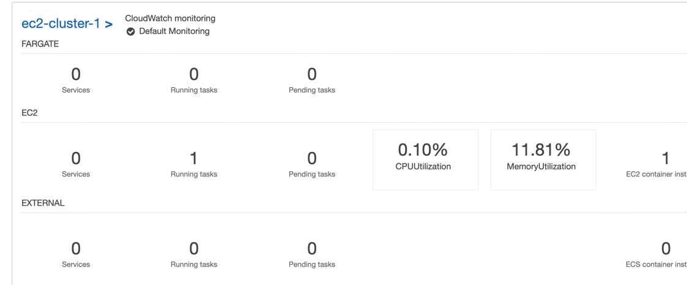
2. Create a new Task Definition with Java container (0-8080 port) and default networking
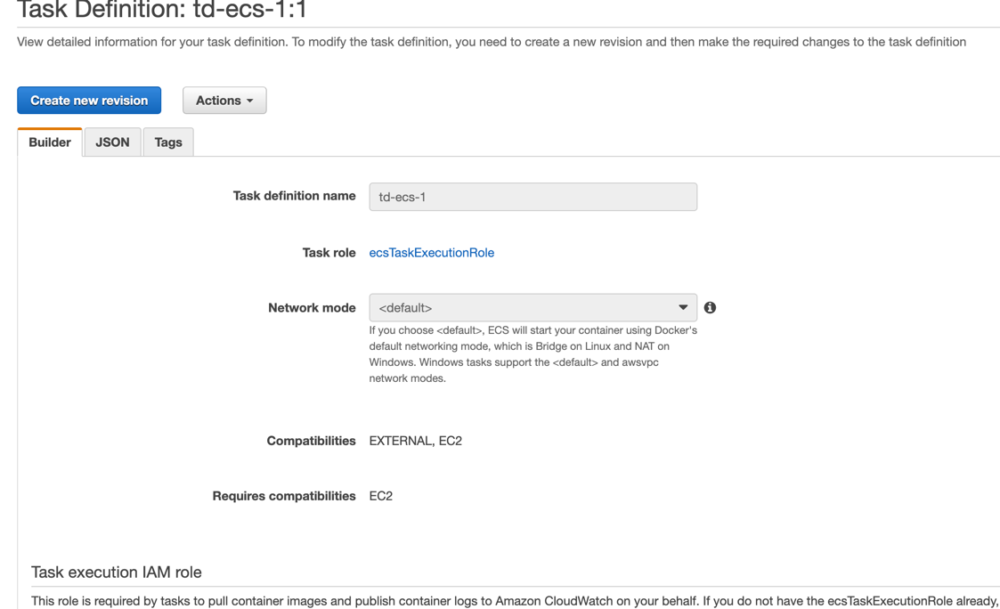
3. Create a new Task in Cluster:
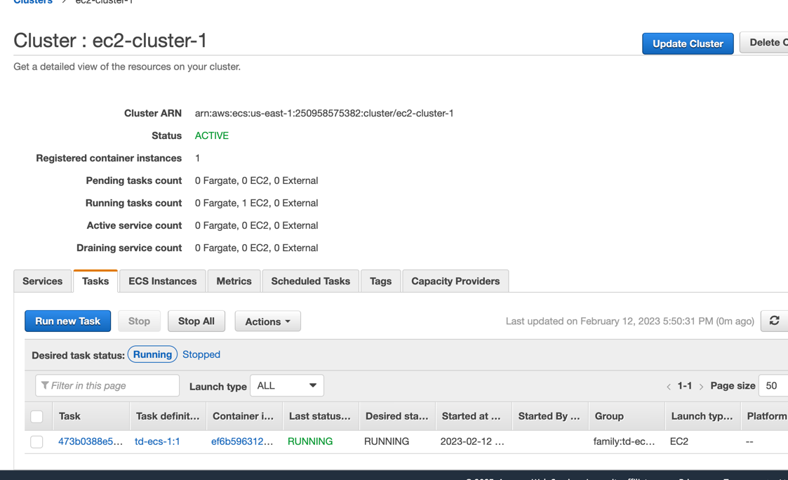

### 2. Deploy ECS Task using Fargate
1. Create VPC (using CloudFormation from previous practice);
2. Create ECR private repo;
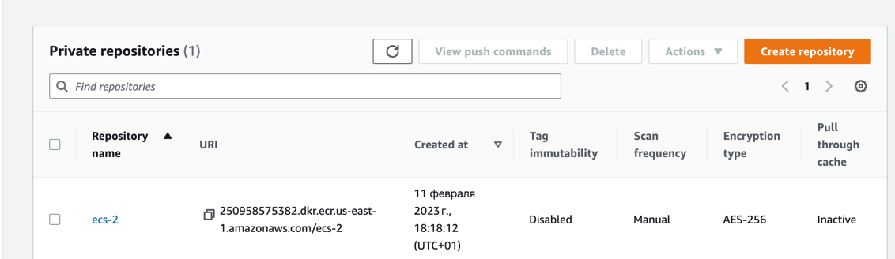
3. After, let's login to ECR from our local Terminal (just copy command from ECR table):
```shell
aws ecr get-login-password --region us-east-1 | docker login --username AWS --password-stdin 250958575382.dkr.ecr.us-east-1.amazonaws.com
docker pull gazgeek/springboot-helloworld
docker tag gazgeek/springboot-helloworld:latest 250958575382.dkr.ecr.us-east-1.amazonaws.com/ecs-2:latest
docker push 250958575382.dkr.ecr.us-east-1.amazonaws.com/ecs-2:latest
```
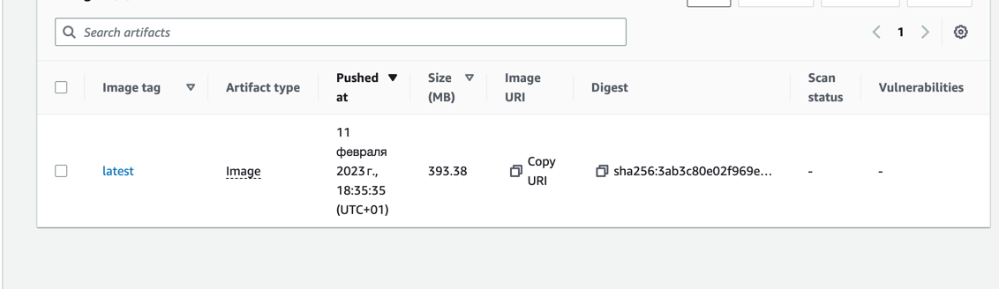
4. Next create ALB with target group and new SG (all with our custom VPC):
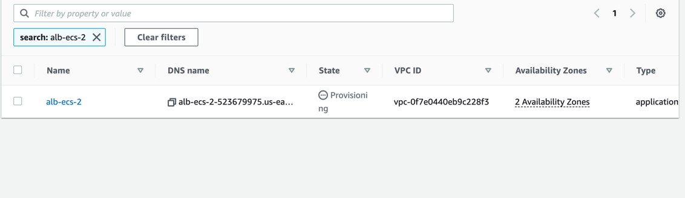
5. Next create Networking only cluster
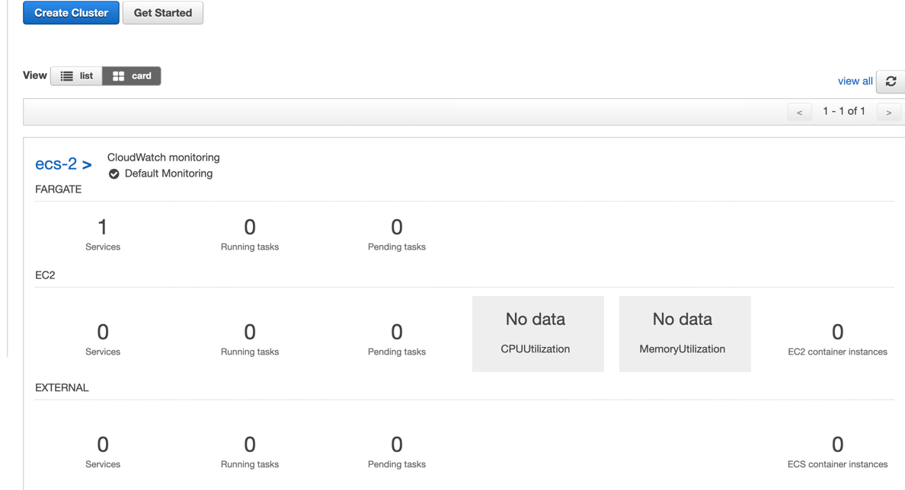
6. Go to Task Definitions and create a new one - Fargate, with our VPC, 2 private subnets, Java image (with new SG) and ALB/TG
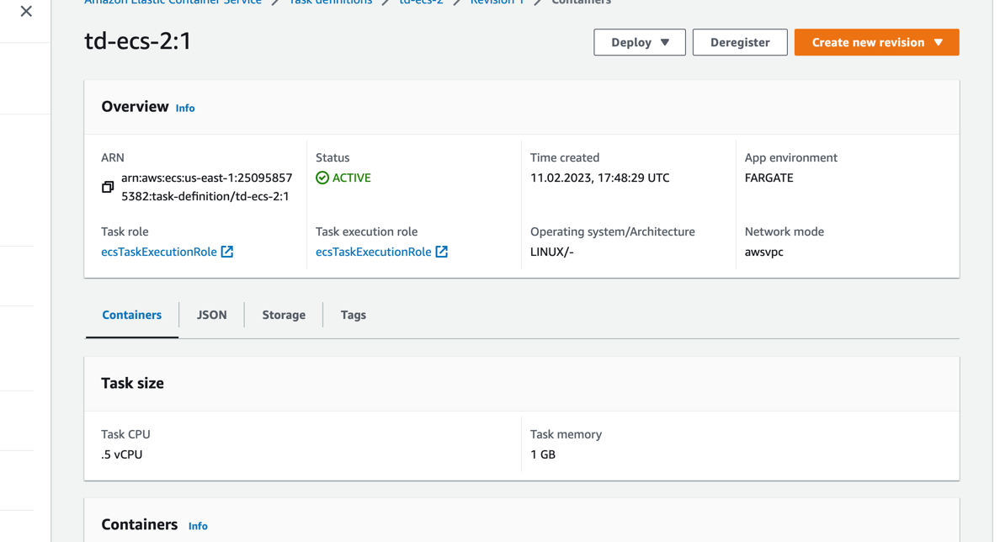
7. Go to Cluster -> Services -> create a new one (we should run our new TD)
8. After that we will have new tasks in Cluster tasks
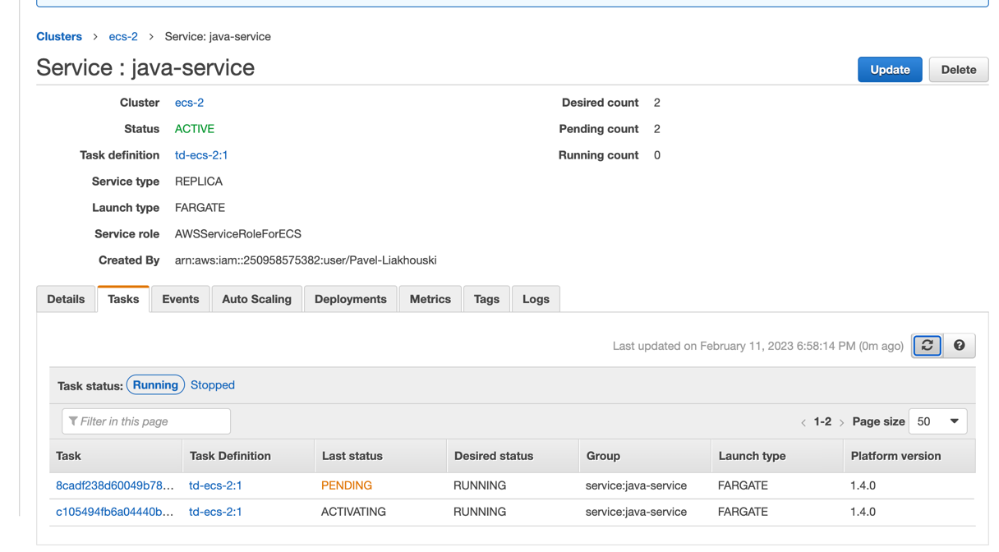
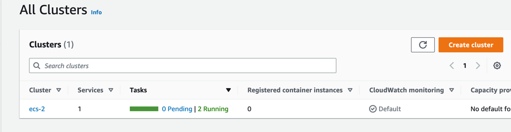
9. Check it using ALB link
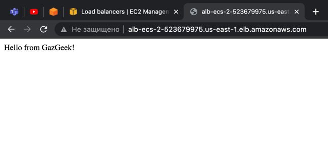
10. Next create a new record in Route53 (alias and ALB) and test it
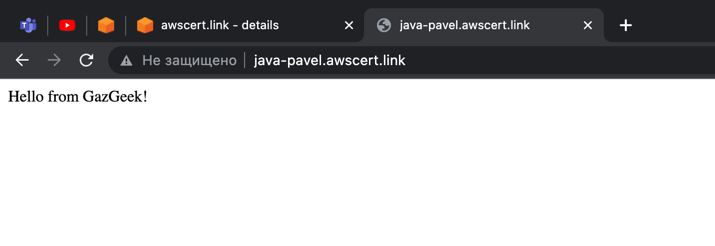
11. Remove all stuff

### 3. Create the same setup as above for ECS using Cloudformation
1. Run VPC cloudformation `ecs_3_vpc.yaml`;
2. Run ECR cloudformation `ecs_3_ecr.yaml`;
3. Push Docker Java image to ECR;
4. Run ECS cloudformation `ecs_3_ecs.yaml`
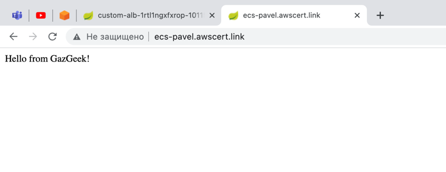
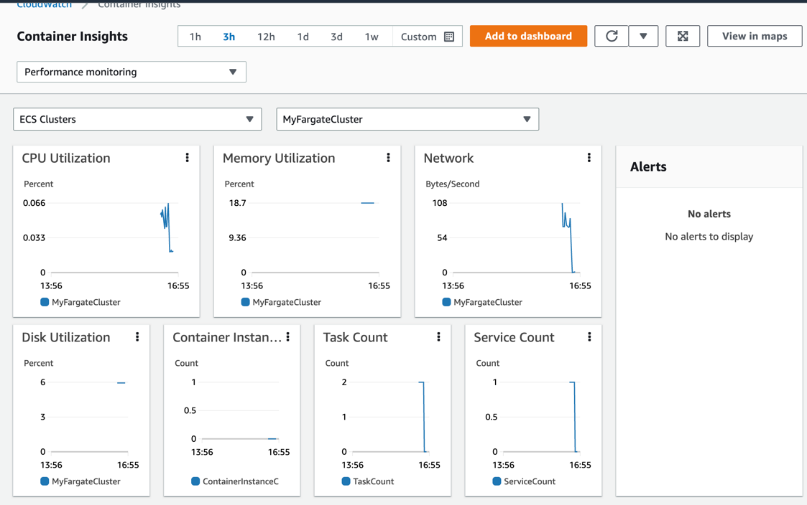