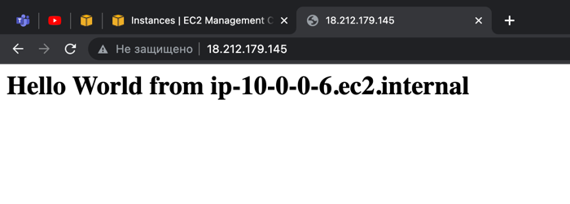

# Route53
## 1. Assign A record for your EC2
1. Create a VPC using CloudFormation yaml file (with at tleast one public and private subnets).
2. Create an EC2 instance with httpd and default html page in Public subnet. Test it using Public IP:

3. Let's go to Route53 -> Hosted Zones -> and create a new record with record type `A`, policy `Simple routing`,
our Public IP address and name `pavel`:

4. Check it using link `pavel.awscert.link` - WORKS!

5. Remove `A` record.

## 2. Alias setup for EC2
1. Let's use an EC2 instance from previous task
2. Create an ALB (with our VPC public subnets, Internet-Facing) and target group with our EC2 instance

3. Check this ALB using DNS link from ALB settings:

4. Let's create alias record using our region and ALB:

5. Check it

6. Delete ALB, EC2 instance and alias record.

## 3. Private hosted zone
1. Let's create an EC2 instance in Private subnet:

2. Create Internal ALB and target group:

3. Create an alias record with this ALB - Timeout Error:

4. Create a Bastion Host and try to ping it from Hosted Zone (using HealthCheck f.e.). But first of all add All ICMPv4 rule to BastionHost SG:

5. Create a HealthCheck for public IP - Works

6. Remove all instances, records and VPC using CloudFormation

Questions
CNAME vs alias:
CNAME only for non-root domain (f.e. something.mydomain.com), points hostname to another hostname, we can point to EC2
Alias - points hostname to AWS resource, works for non-root AND root domain (mydomain.com), FREE.

Simple routing lets you configure standard DNS records, with no special Route 53 routing such as weighted or latency. 
With simple routing, you typically route traffic to a single resource, for example, to a web server for your website.

Failover routing lets you route traffic to a resource when the resource is healthy or to a different resource 
when the first resource is unhealthy.

Geolocation routing lets you choose the resources that serve your traffic based on the geographic location of your 
users, meaning the location that DNS queries originate from.

Geoproximity routing lets Amazon Route 53 route traffic to your resources based on the geographic location 
of your users and your resources.

If your application is hosted in multiple AWS Regions, you can improve performance for your users by serving 
their requests from the AWS Region that provides the lowest latency.

Weighted routing lets you associate multiple resources with a single domain name (example.com) or
subdomain name (acme.example.com) and choose how much traffic is routed to each resource. 