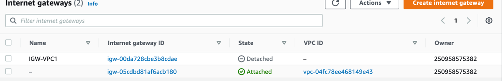
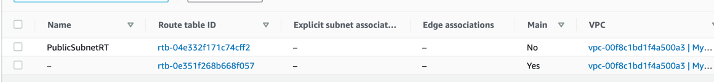
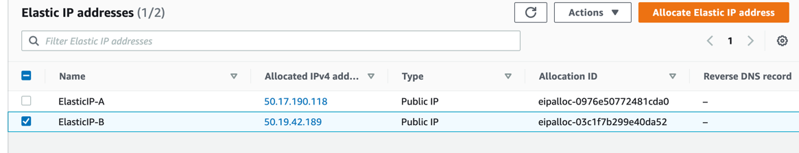
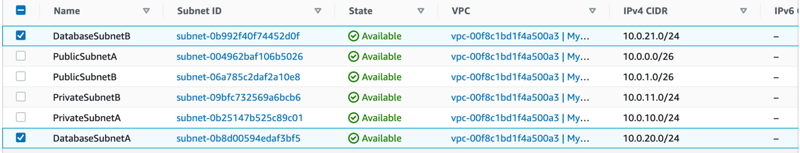
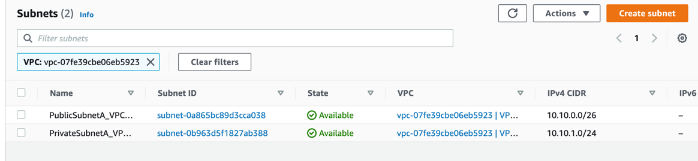
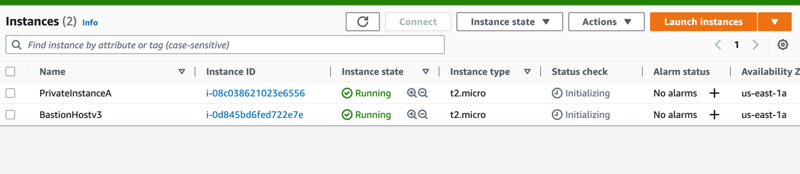
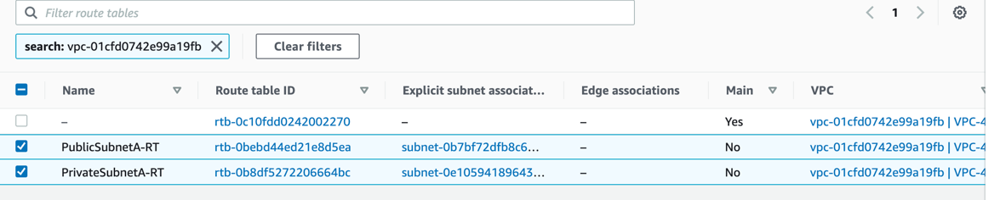

# VPC
## 1. Create manual VPC setup
### VPC Setup
1. Create a VPC with Resource - `VPC only`, tenancy - `default` and CIDR - `10.0.0.0/16`:

2. Let's create 2 public subnets (for A and B AZs) with CIDR `10.0.0.0/26` and `10.0.1.0/26`:

3. Let's edit subnet settings for Public subnets. BUT it's not required because we can do it when we are creating an EC2 instance:

4. Next let's create an Internet Gateway to access to Internet from our Public Subnets:

5. Next we need to attach this IGW to our new VPC (can be only one IGW for VPC):

6. Next we need create a new Route Table for Public Subnets. After that we should attach 2 our Public Subnets to this RT:


7. Then we should add a new Route for this RT to make access for all IPs to our new IGW:

8. Next - Private Subnets. Let's create 2 Subnets for A and B AZs with CIDR `10.0.10.0/24` and `10.0.11.0/24`:

9. After let's create 2 new Route Tables for each of Private Subnet. Also let's attach them to RT:

10. After that let's create two Elastic IPs (they will be for NAT gateways):

11. After that we can create 2 NAT Gateways (for A and B Public Subnets) with 2 Elastic IPs:

12. After that we should add new route in Private Route Tables with all IPs and new NATG:

13. Next let's create 2 Database Subnets A and B AZs and CIDRs `10.0.20.0/24` and `10.0.21.0/24`:

14. Let's create new Table Routes for each of Database Subnet and attach Subnets to them:


### Test setup
1. Let's create a Bastion Host (simple EC2 instance in PublicSubnet) in our VPC network! Before will be better 
to create a new SG (don't forget to add SSH inbound rule):


2. Next let's create 2 instances - one for Private Subnet and one for Database Subnet (with our own key) in our new VPC:

3. Let's connect to Bastion host:

4. Let's create a .pem file with the key to our Database and Private instances:
```shell
nano my_key.pem # paste our key
cat my_key.pem # check key
chmod 0400 my_key.pem # add permission to file
ssh ec2-user@<private_ip_address> -i my_key.pem # connect to private instance 
ping google.com # success
```

```shell
ssh ec2-user@<database_ip_address> -i my_key.pem # connect to private instance 
ping google.com # failed
```

5. Delete all stuff for this card (ps. it was a pain!!!)

## 2. VPC peering
1. Create a first VPC - `VPC-A` in our region (N.Virginia). CIDR - `10.10.0.0/16`

2. Create 1 public and 1 private subnets for VPC-A. Public CIDR - `10.10.0.0/26`, private CIDR - `10.10.1.0/24`.:
Don't forget create Route groups for each subnet, attach subnets and add new route for Public - any IPs and IGW. Also 

3. Let's create a second VPC - `VPC-B` in another region (N.California). CIDR - `10.20.0.0/16`

4. Create 1 private subnet for VPC-B. CIDR - `10.20.1.0/24`

5. Go back to VPC-A. Create a new SG for Bastion Host with SSH inbound rule and a Bastion Host inside our VPC-A Public subnet:

6. Create 2 instance in private subnets in 2 VPCs (don't forget to create a new key-pair in a new region). :
Also don't forget for VPC-B Private instance SG add new inbound rule - All ICMPv4 and CIDR - `10.10.0.0/16`:


7. Now we can create a VPC Peering:

8. Accept VPC Peering request in another region (N.California):

9. Next we should modify BOTH VPC Route Tables to use the VPC Peering:


10. Next - let's connect to Bastion host and next connect to a Private Instance using pem key (from this region):

11. Next let's create a new pem key to another region, ping and connect:

12. Remove all stuff from both of regions!

## 3. VPC Gateway endpoint
1. Create a default S3 bucket:

2. Create VPC, 1 Private subnet and 1 Public subnet, RTs, IGW


3. Create a SG for Bastion Host, Bastion Host in Public Subnet and EC2 instance in Private Subnet:

4. Create IAM role with full S3 access and set this role to Private EC2 instance:

5. Create new Endpoint in a new VPC, S3 Endpoint and Private Subnet with default settings:

6. Let's test. Go to Bastion Host, ssh connect to Private instance, check google.com (doesn't work) and check ls s3 - 
works!
```shell
nano key.pem
chmod 0400 key.pem
ssh ec2-user@<private_ip> -i key.pem
ping google.com
aws s3 ls --region us-east-1
nano file_for_s3.txt
aws s3 cp file_for_s3.txt s3://vpc-3-s3 --region us-east-1 
```

7. Check in S3 bucket:

8. Remove all stuff.

## 4. VPC Interface endpoint and SQS
1. Create a new VPC, 1 private and 1 public subnets, 2 RTs and EGW. Enable DNS hostnames and DNS resolution in VPC settings:



2. Create Bastion host SG, Bastion Host and private instance:


3. Create a new IAM role with full SQS access and attach it to Private instance:

4. Create an Endpoint Interface with: SQS interface, new VPC, A AZ, private subnet, DNS enabled, private EC2 SG.

5. Create SQS

6. Let's connect to Bastion Host, next to private instance and send message:
```shell
aws sqs send-message --queue-url https://sqs.us-east-1.amazonaws.com/250958575382/VPC4-SQS --message-body "Just example message from Private EC2 instance" --endpoint-url https://vpce-030e7561ecece1d7d-8vq0rclr.sqs.us-east-1.vpce.amazonaws.com --region us-east-1 --delay-seconds 0 --message-attributes file://send-message.json
```

The response is:
```shell
{
    "MD5OfMessageBody": "2a713952ff23e1bae3274e3767234d2e", 
    "MD5OfMessageAttributes": "28eb0e573cf8e8a77e349a2f968eac4a", 
    "MessageId": "6cbb2e87-6b28-4149-990e-efcae9830afd"
}
```

7. Remove all stuff.

## 5. VPC via Cloudformation
1. Create a stack using from assets

## 6. Questions:
1. What is VPC Peering? A VPC peering connection is a networking connection between two VPCs that enables you to 
route traffic between them using private IPv4 addresses or IPv6 addresses.
2. 
- You cannot have more than one VPC peering connection between two VPCs at the same time
- You cannot connect to or query the Amazon DNS server in a peer VPC
- Active VPC peering connections per VPC - 50 - 125
- Outstanding VPC peering connection requests - 25 - ...
- Expiry time for an unaccepted VPC peering connection request - 1 week - ...
- You cannot create a VPC peering connection between VPCs that have matching or overlapping IP
- VPC peering does not support transitive peering relationships
3. What are VPC Endpoints? Interface endpoints enable connectivity to services over AWS PrivateLink. 
A gateway endpoint targets specific IP routes in an Amazon VPC route table, in the form of a prefix-list, 
used for traffic destined to Amazon DynamoDB or Amazon Simple Storage Service (Amazon S3). Gateway endpoints 
do not enable AWS PrivateLink.
4. What is VPC Private Link? AWS PrivateLink is a highly available, 
scalable technology that enables you to privately connect your VPC to services as if they were in your VPC. 
You do not need to use an internet gateway, NAT device, public IP address, AWS Direct Connect connection, 
or AWS Site-to-Site VPN connection to allow communication with the service from your private subnets (NLB + ESI)
5. Site-to-site VPN -  A secure connection between your on-premises equipment and your VPCs. Only for IPv4.
An encrypted link where data can pass from the customer network to or from AWS. VirtualPrivateGateway + CustomerGateway
6. Direct connect - enables you to establish a dedicated network connection between your network and one of the AWS Direct Connect locations.
7. NACL vs SG. SG - EC2 instance level, only allow rules (not deny), do changes in inbound - automatically in outbound,
first layer of defense, you should directly set SG to instance.
NACL - subnet level, allow AND deny rules, do changes in inbound - you can or can't add it to outbound, second layer of defense,
you have not to add NACL directly to instance, has the table of priority of rules.
8. Public vs private vs elastic addresses. 
A private IPv4 address is an IP address that's not reachable over the Internet. You can use private IPv4 addresses for communication between instances in the same VPC.
A public IP address is an IPv4 address that's reachable from the Internet. You can use public addresses for communication between your instances and the Internet.
An Elastic IP address is a public IPv4 address that you can allocate to your account. You can associate it to and disassociate it from instances as you require.
9. DHCP. IP addresses are assigned dynamically by DHCP servers using the Dynamic Host Configuration Protocol (DHCP).
