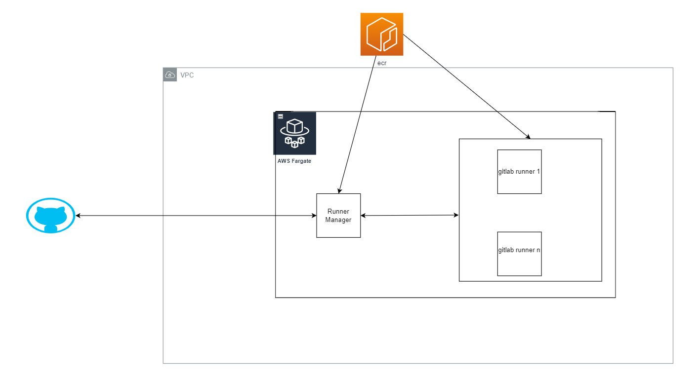
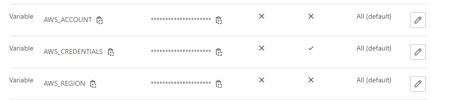

# Raise AWS ECR Repositories
It will provide you all the repositories that currently in use.

## Prepare a container image for the Runner Manager
First step is to create image of Runner Manager. This is a task inside of a ecs cluster that responisble for delegating jobs.

#### ECR repository Name it gitlab-runner-manager

Go to runner/runnermgr folder

Run commands from the ECR Repo from the step 1

aws ecr get-login-password --region us-east-1 | docker login --username AWS --password-stdin {AccountId}.dkr.ecr.us-east-1.amazonaws.com

docker build -t gitlab-runner-manager .

docker tag gitlab-runner-manager:latest {accountId}.dkr.ecr.us-east-1.amazonaws.com/gitlab-runner-manager:latest

docker push {accountId}.dkr.ecr.us-east-1.amazonaws.com/gitlab-runner-manager:latest

Prepare a container image for Runners
You need to create a container templates for all your jobs. Here we have the next templates:

Kaniko

Gradle

Default

Go to runner folder

Then one by one build and push all the existing templates

Run commands from the ECR Repo from the step 1

aws ecr get-login-password --region us-east-1 | docker login --username AWS --password-stdin {AccountId}.dkr.ecr.us-east-1.amazonaws.com

docker build -t {repo-name} .

docker tag {repo-name}:latest {accountId}.dkr.ecr.us-east-1.amazonaws.com/{repo-name}:latest

docker push {accountId}.dkr.ecr.us-east-1.amazonaws.com/{repo-name}:latest

Raise AWS infrastructure
This template provide full infrastructure out of the box. It will create vpc, ecs cluster, ecs service for runner mgr, prepare task defenition for mg

Params:

DesiredTasks - count of runner mgrs tasks

EnvironmentName - gitlab

GitlabHost - based on where gitlab is deployed

GitlabSharedRunnerKey - The key from the gitlab repo. Must be groupRunner. Path https://gitlab.com/groups/{your_group_name}/-/runners

Create a credentials variable inside gitlab group
Create an AWS_CREDENTIALS.

Create a line with aws gitlab user (accesskey and accessId) and incode it with Base64 Encode and Decode - Online .

FQA
What is diffrenet between concurrent and limit inside the runner?
While concurrent defines the global concurrency limit across multiple [[runners]] workers, limit defines the maximum concurrency for a single [[runners]] worker.

More here

cache cdk-fargate-gitlab-runner/config_runner_template.toml at main · aws-samples/cdk-fargate-gitlab-runner

Useful links
https://docs.gitlab.com/runner/configuration/advanced-configuration.html#the-global-section

https://medium.com/@shantanujain92/autoscaling-gitlab-deployments-using-aws-fargate-a62f4baea181

https://medium.com/ci-t/serverless-gitlab-ci-cd-on-aws-fargate-da2a106ad39c

https://docs.gitlab.com/runner/configuration/runner_autoscale_aws_fargate/

https://about.gitlab.com/blog/2020/07/31/aws-fargate-codebuild-build-containers-gitlab-runner/

https://stackoverflow.com/questions/28717814/proper-way-to-automatically-start-and-expose-ssh-when-running-my-app-container

https://stackoverflow.com/questions/71934006/gitlab-fargate-unable-to-pull-image-during-ci-cd/71943101

https://webera.blog/building-docker-images-without-docker-using-kaniko-gitlab-ci-and-aws-c85ee802a4b0

https://github.com/aws-samples/cdk-fargate-gitlab-runner/blob/main/gitlab_ci_fargate_runner/docker_fargate_driver/config_runner_template.toml