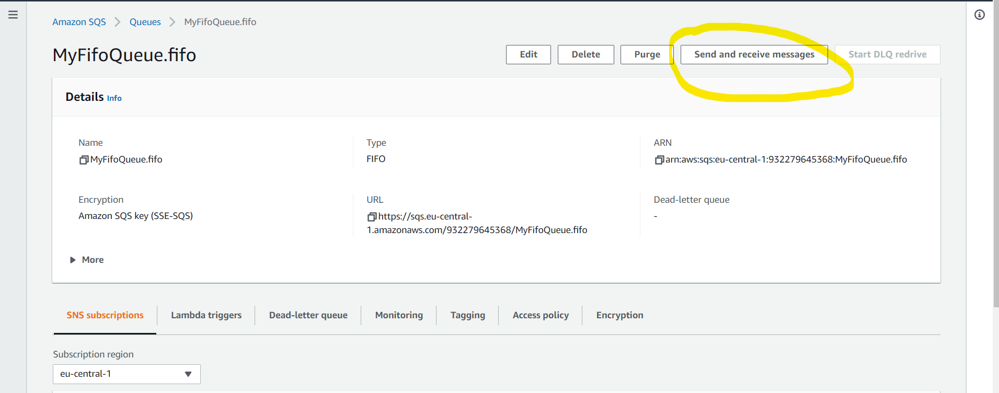
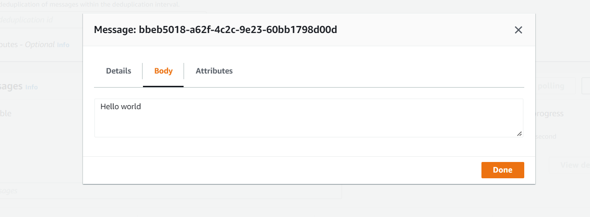
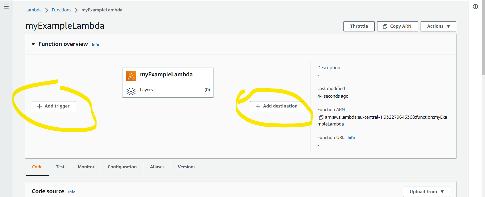
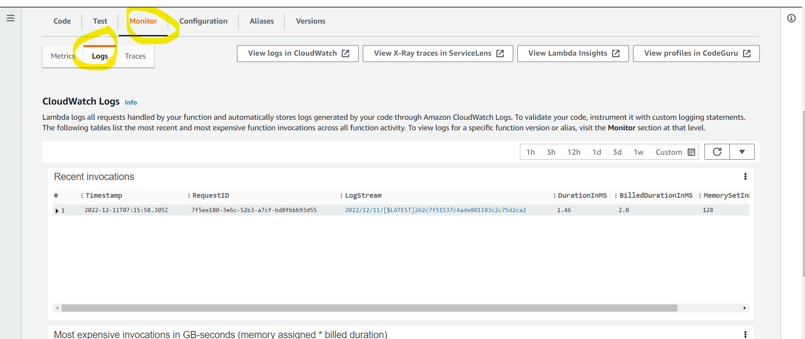
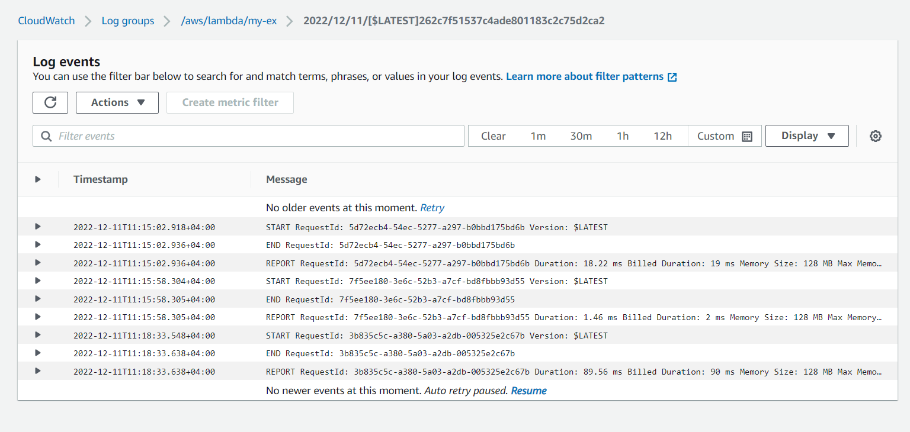

# Task with SQS

### Introduction to Simple Queuing Service.

- Create FIFO and Standard Queue using the Console.
- What is Long Polling and configuring Long Polling for the queue. 
- What is Visibility Timeout and configuring Visibility Timeout.
- What is Delay Queue and configuring Delay Queue.
- Purge Queue and verify the same.
- SQS points to remember.

Try sent message

And read it.

Task ended!

### Don't forget to delete everything you've done.

### Creating CloudWatch Logs for SQS by Triggering a Lambda function.

- Create a SQS Queue.
- Create a Lambda Function.
- Check the CloudWatch Logs.

Create queue

Create and configure Lambda function as in the diagram.

After creating Lambda and configure send message.

Task ended!

### Don't forget to delete everything you've done.

### Add SNS subscription filtering for SQS.

Just follow the instructions.

[Link] : https://docs.aws.amazon.com/AWSEC2/latest/UserGuide/ebs-using-volumes.html

