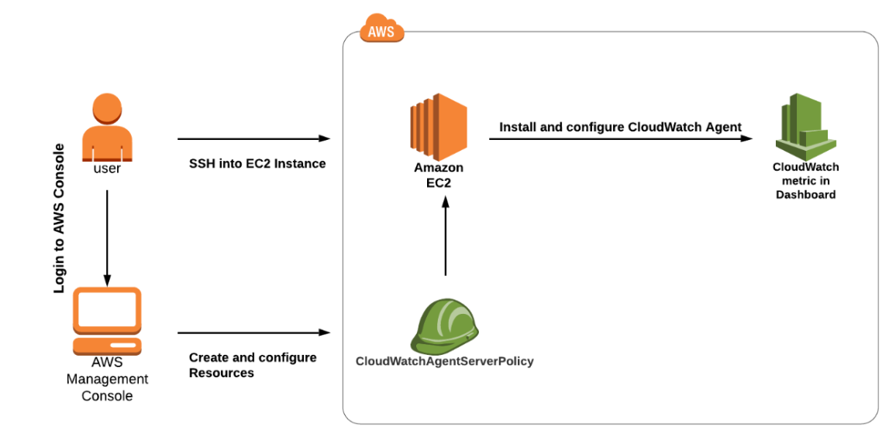
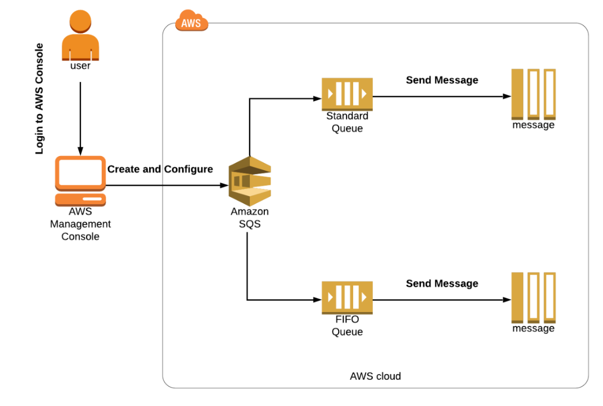
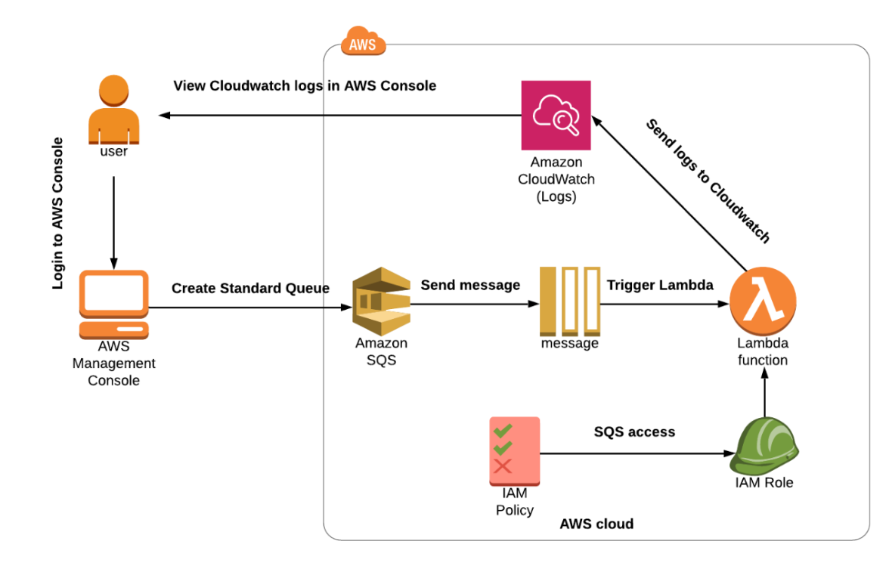
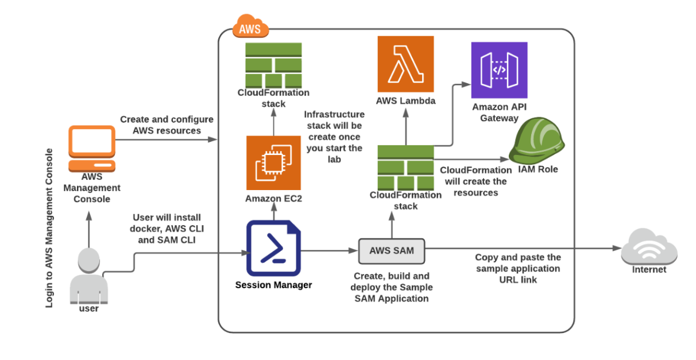
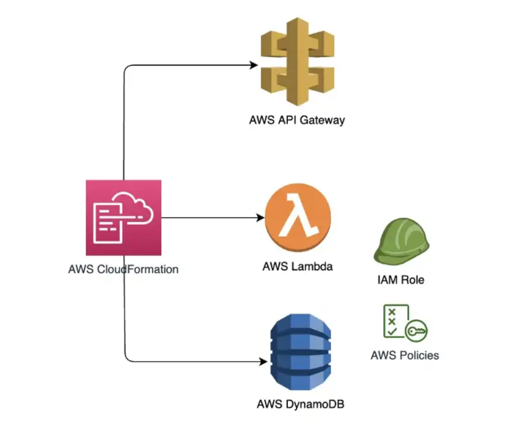

# Table of contents

1. [EC2](#ec2)
2. [CloudWatch, SNS, SQS](#cloudwatch-sns-sqs)
3. [Route53](#route53)
4. [VPC](#vpc)
5. [ECS](#esc)
6. [CI-CD](#ci-cd)
7. [SAM](#sam)
8. [RDS](#rds)
9. [ElasticCache](#elasticcache)
10. [DynamoDB API Gateway Lambda Secret Manager X-Ray](#DynamoDB API Gateway Lambda Secret Manager X-Ray)
11. [CronJobs via aws: EventBridge + Lambda](#cron-job-event-bridge-lambda)
12. [S3 + CloudFront, AWS Shield, WAF](#s3-waf-shield)
13. [Beanstalk](#beanstalk)
14. [AWS Autoscaling](#autoscaling)
15. [AWS Cognito](#cognito)
16. [Security & encryption: KMS, Secret Manager, SMM](#security-kms)
17. [Monitoring tools](#monitoring-tools)
18. [AWS Config, System Manager, Amazon Inspector](#config-smm-inspector)
19. [Final Section](#final-section)

<a name="ec2"></a>

## EC2

###### Included: EBS, EFS, Instance Store, ALB, Target Group, Auto Scaling Group, Launch template, Launch Configuration

#### Goal: Get hands-on experience with aws core service: EC2.

#### Launch internet accessible web server using ec2 with manual setup

Launch ec2 instance, setup web server using httpd and html page, test it via public ip address.

#### Setup EC2 using userdata

Automate step 1 using userdata. Do your steps to set up a web server via userdata, test it via a public ip address.

#### Setup EC2 using userdata and create a static public ip address.

Reproduce previous step, attach elastic ip, reboot instance, test it via elastic ip.

#### Create an ec2 server and test access for S3.

Create a test s3 bucket (just a simple s3 bucket with full default settings).
Create EC2 and try to get a list of S3 buckets in the account. You should get an error, google it and try to understand
why.
Fix the error using iam role with right iam permissions.

#### Launch template

Create a Launch template with basic settings and userdata.
Test it via public ip.

#### Setup highly available server stack using ALB + Target Group

Create a fleet of EC2 instances ( at least 2 servers) with your userdata. You can use the Launch template from the
previous step.
Create a target group. (use Instances for target type)
Create ALB. Choose at least two subnets, don`t forget to create a security group for alb.
Test your application via ALB DNS name.
Make sure your server does not accessible via server public ip (only from ALB)
(This should be done via properly configured security group)

#### Spot Fleet

Creating a launch template with default settings, with t2.micro linux image and httpd userdata.
Create an auto scaling group and test it via ALB.
Create Spot Fleet Request with existing launch template.
Test instance via public IP.
Interrupt a Spot Instance directly from Amazon EC2 Console.
What is the difference between allocation strategy?

#### Create AMI with httpd server

Create ec2 with httpd and html page. Launch instance using AMI and test that httpd works.

#### Launch Configuration and Autoscaling group

Create launch configuration using previous AMI and autoscaling group based on it.
Test it via ALB.

#### EBS & EFS

#### EBS and ec2

Create EC2. Create EBS. Attach it to newly created ec2.
Create a file on this new EBS.
Create a second Ec2 and reattach this ebs to the second ec2.
Ssh to the second instance and double check that you have a file from the first instance

#### EFS and ec2

Create EC2. Create EFS.
Attach EFS to EC2.
Try to upload a file on EFS from this EC2.

#### EBS and EC2

Create an EC2 instance with next ebs settings:
Create one more ebs volume
Do not delete after instance terminated
Type: gp3
Name: /dev/sdy/
Encrypted using default key
Delete ec2 instance, test that your ebs volume is still there.
Delete it.

#### Placement Group

Create all 3 types of placement groups.
Launch 2 instances in each.
Describe the difference.

### Theory

* Compare Saving plans and reserved instances
* Placement groups. What is the benefits
* EFS vs EBS
* What is an instance store?

<a name="cloudwatch-sns-sqs"></a>

# CloudWatch, SNS, SQS

#### Using CloudWatch for Resource Monitoring, Create CloudWatch Alarms and Dashboards

Create EC2 Instance.SSH into EC2 Instance.
Create SNS Topic.
Subscribe to an SNS Topic. (via email)
Check EC2 CPU Utilization Metrics in CloudWatch Metrics.
Create CloudWatch Alarm.
Testing CloudWatch Alarm by Stressing CPU Utilization. (stress --cpu 2 --timeout 60)
Checking For an Email from the SNS Topic.
Checking the CloudWatch Alarm Graph.
Create a CloudWatch Dashboard.

#### Install CloudWatch Logs Agent on EC2 Instance and View CloudWatch Metrics

Create an EC2 instance.
SSH into EC2 Instance.
Download and Install the Cloudwatch agent on EC2.
Configure and Start the Agent.
View the metric in the Cloudwatch Metrics.



#### Create an Alarm Using a Metric Filter

Create an SNS topic
Create an email subscription to the topic
Create a log group and configure the log group to retain logs for 1 year.
Create a metric filter using the previous log group and name it http-5xx-metric. Create a filter pattern that monitors
all of the HTTP 500-level errors and name it http-5xx-filter. Use these log events to test the pattern you created.
127.0.0.1 - - [24/Sep/2013:11:49:52 -0700] "GET /index.html HTTP/1.1" 500 287 2
127.0.0.1 - - [24/Sep/2013:11:49:52 -0700] "GET /index.html HTTP/1.1" 500 287 3
127.0.0.1 - - [24/Sep/2013:11:50:51 -0700] "GET /~test/ HTTP/1.1" 200 3 4
127.0.0.1 - - [24/Sep/2013:11:50:51 -0700] "GET /favicon.ico HTTP/1.1" 501 308 5
127.0.0.1 - - [24/Sep/2013:11:50:51 -0700] "GET /favicon.ico HTTP/1.1" 503 308 6
127.0.0.1 - - [24/Sep/2013:11:51:34 -0700] "GET /~test/index.html HTTP/1.1" 200 3

5. Create an alarm using the custom metric filter you just created. Set the metric name to http-5xx-sum.
6. Configure the alarm to evaluate every minute and set the total threshold to greater than 5. Then, set the alarm
   threshold to 3 units.
7. Publish a message to the topic when the ALARM state is triggered. Set the alarm name to 5xx-alarm.

#### SQS

#### Introduction to Simple Queuing Service

Create FIFO and Standard Queue using the Console.
What is Long Polling and configuring Long Polling for the queue.
What is Visibility Timeout and configuring Visibility Timeout.
What is Delay Queue and configuring Delay Queue.
Purge Queue and verify the same.
SQS points to remember.



#### Creating CloudWatch Logs for SQS by Triggering a Lambda function

Create a SQS Queue.
Create a Lambda Function.
Check the CloudWatch Logs.



#### Add SNS subscription filtering for SQS

https://aws.amazon.com/getting-started/hands-on/filter-messages-published-to-topics/

<a name="route53"></a>

# Route53

#### Assign A record for your EC2

Create ec2 with httpd web server in public subnet
Create A record in ec2 for IP address of ec2
Test it

#### Alias setup for EC2

Create ec2 with httpd web server in public subnet
Create ALB and target group
Create alias for alb.
Test it

#### Private hosted zone

Create a ec2 instance in private subnet
Create internal ALB + target group
Create private hosted zone and point alias to this ALB
Try to call this alias from your browser
Create a bastion in the public subnet and try to ping this ec2 using the hosted zone.

#### Questions:

* Alias vs Cname
* Routing policies: Failvoer, Geolocation, Geo Proximity. Weighted Latency When to use?

<a name="vpc"></a>

# VPC

#### Create manual VPC setup

VPC setup:

* 2 availability zones
* 2 public & 2 private & 2 database subnets
* 2 nat gateway for high availability (explain why)

Test setup:

* Create bastion instance and test ssh connection to it
* Create ec2 in private and database subnets.
* SSH to instance in private and database subnet
* Test instances with ping command (What should be added to the security group ? )

#### VPC peering

Goal: We want to have 2 private ec2 instances that will talk via a private network. Make them behave as if they were in
the same vpc.

* Create VPC A and VPC B in different regions.
* Create 2 subnets for VPC A: 1 public subnet and 1 private subnet.
* For vpc B just one private subnet.
* Create a bastion host inside of VPC A in a public subnet.
* Create an ec2 instance in each VPC in a private subnet.
* Create VPC Peering Connection from A to B
* Accept connection in vpc B
* Modify Route tables for both VPC.
* Connect to vpc A bastion host, then to private instance in private subnet then ping private instance in vpc B, then
  ssh to private instance in vpc B.
*

Notes:

* ! Remember CIDRs must be non-overlapping
* 10.10.0.0/16
* 10.20.0.0/16
* Open 22 for ssh in security groups
* Add ICMP for VPC cidr range for instance vpc b security group (for ping)

#### VPC Gateway endpoint

Goal: upload file in s3 bucket using vpc gateway endpoint without using public internet

* Create a default S3 bucket
* Create a VPC with 2 subnets: 1 public and 1 private. 10.10.0.0/16
* Launch bastion host and instance in private subnet.
* Create a proper iam role for private instance, give s3 full access permissions.
* Create a Gateway Endpoint. Open in vpc Endpoints
* Search for S3 and choose Gateway endpoint.
* Choose your vpc and choose a private subnet.
* Create a text file in a private instance.
* Upload it on your s3 bucket: aws s3 cp file.name s3://bucket-name -- region name

#### VPC Interface endpoint and SQS

Goal: access aws services with private network using vpc interface endpoint

* Create a VPC with 2 subnets: 1 public 1 private
* Launch bastion host and server in private subnet.
* Create an IAM role with full access for SQS for private instance.
* Open endpoints for VPC
* Search for SQS with Interface type
* Choose vpc, az and your private subnet
* Enable DNS name should be enabled!
* Create a security group for HTTPS from your vpc CIDR.
* Select this group for the endpoint.
* If you get an error, don't forget to enable DNS Resolution and DNS Hostname for your vpc :)
* Copy a queue url from SQS service for the next command.
* Verify that you got a message in sqs service interface.

Example of the send message command: https://docs.aws.amazon.com/cli/latest/reference/sqs/send-message.html

#### VPC via Cloudformation

* Create a vpc with template.
* Compare vpc from CloudFormation with manually vpc from taks 1.
* Create a vpc setup from step 1 via cloudformation.
* Test it in the same way with ec2 instances.

### Questions:

* What is VPC Peering?
* What is the limitation for vpc peering?
* What are VPC Endpoints?
* What is VPC PrivateLink
* What is Site-to-Site VPN?
* What is direct connect?

<a name="esc"></a>

# ESC & ECR

#### Deploy web application using ECS Based on Ec2 & Fargate

1. Deploy ECS task using EC2

2. Deploy ECS Task using Fargate

3. Deploy using ECS Service based on Fargate
   Create custom VPC
   Create ECR repo
   Push docker image of java web application
   Create an alb and target group
   Create ECS cluster
   Create task definition
   Create ecs service inside cluster
   Run 2 task
   Test it via alb dns name.
   Create route53 alias for ALB.
   Test it via alias

#### Create the same setup as above for ECS using Cloudformation

Note. route53 should be set manually

<a name="ci-cd"></a>

# CI\CD: CodeCommit, CodeBuild, CodeDeploy, CodePipeline

#### Gitlab Ci\Cd

* Create ci cd via Gitlab for the application from step 2 based on single runner on EC2 using shell executor

* Create cicd via Gitlab for app from step 2 based on Custom executor with custom config based on ECS (note, this step
  can be done via cloudformation from the scratch)

* Create cloudformation for step 2.

Pipeline for git lab:

1. Build project
2. Run tests (if exists)
3. Create image and push to ECR via docker

##### Advanced: Create a deployment process to the existing cluster (from step 5) using aws cli commands inside of stage in gitlab yaml file

#### AWS Ci\Cd

Goal: Set up a ci\cd for your project based on aws ci\cd services.

You need to push your existing code to CodeCommit.
Create a pipeline using CodePipeline.
Setup this pipeline to be able to download code from CodeCommit, build it using CodeBuild and deploy via CodeDeploy to
two sources: EC2 and Beanstalk.

<a name="sam"></a>

# SAM

#### Create, build and Deploy a Sample Hello World App using AWS SAM

SSH into EC2 Instance using Session Manager
Install Docker, AWS CLI, and SAM CLI
Configure the AWS CLI on EC2 Instance
Download the sample SAM Application (sam init -> choose python3.9)
Build and Deploy your application



#### Create a Serverless app using SAM: API Gateway, Lambda, DynamoDB.

To create a DynamoDB Table: Type: AWS::Serverless::SimpleTable
To create API Gateway: Type: AWS::Serverless::Api
Create at least GET & POST endpoints
2 REST endpoints: POST /users GET /users
SAM BUILD
sam deploy --guided



#### Questions:

* Why do we need sam?
* How hoes sam work?
* SAM vs Cloudformation
* List out commands used in AWS SAM CLI
* Which languages does sam support?

<a name="rds"></a>

# RDS

#### RDS based on PostgreSQL + Cloudwatch metrics

* Create RDS with Postgresql engine.
* Connect to db with dbviewer or other tool
* Test db with java application with add and get
* Create a read replica
* Make old db read only
* Promote read replicate to standalone db
* Kill old db
* Test new db with Java application
* Make a snapshot
* Delete db
* Restore via snapshot
* Resize db to bigger size via maintain window

#### RDS Multi-AZ + failover In custom VPC + Cloudwatch insights

* Create custom VPC
* Place db into private subnet
* Create mysqldb multi az
* Connect and test that is works via ec2 bastion или хз как еще придуамй
* Simulate failover (reboot) Which other options exist?
* Check that az changes

_Note:_
Amazon RDS provides an option to simulate Availability Zone failure and High Availability (HA) by offering an option to
reboot the Oracle DB instance with the failover. This option initiates Availability Zone level failover and the instance
on the secondary Availability Zone becomes primary, and the instance on the primary Availability Zone becomes secondary.

* RDS snapshot + encryption

1. A company is deploying a new web application. Configure a highly available MySQL 8.0 database with the following:
2. Unless specified below, use the default configuration settings.
3. Create a custom DB parameter group and set the event_scheduler parameter to true and use this parameter group during
   DB instance creation.
4. Create a custom AWS Key Management Service (AWS KMS) key and use this key during DB instance creation.
5. Create a VPC security group that allows TCP port 3306 from the CIDR block 192.168.1.0/24. Use this security group
   during DB instance creation.
6. Launch the Amazon RDS DB instance.
7. After launch, take a manual RDS DB snapshot.
   Provide the snapshot Amazon Resource Name (ARN):

#### RDS + AWS Backup

Goal: create automatic backup strategy using AWS Backup service

[Flow](https://aws.amazon.com/getting-started/hands-on/amazon-rds-backup-restore-using-aws-backup/)

#### RDS Cloudformation for Postgresql

Create a script:

* Environment as parameter
* Name as parameter
* instance class as list + parameter
* Storage type as list
* public accessible as param default false
* port, username, password as parameter
* multi-az parameter
* delete on termination as parameter
* Include other params as you wish
* Configure backup
* Create a good output section

Parameter group should be created in the same template with default settings

* override or create new at least one parameter

### Aurora

#### Create an Aurora database with PostgreSQL or Mysql engine

Goal: just to create a manual setup in **private** VPC (you need to create it previously) , connect to db and review a
possible db settings.

* You need to find which option do we have to connect to db in private
  subnet. [Examples](https://www.linkedin.com/pulse/connecting-rds-db-private-subnet-aws-from-using-ssm-port-srinivasan/?trk=pulse-article_more-articles_related-content-card)
* Choose an option, best one is NLB.
* Connect to db, create a table and make a test select

#### Aurora DB: Performance insight, Test fault tolerance, Global Database,

##### You can use this guide as a good example, [guide link](https://awsauroralabsmy.com/provisioned/create/)

Steps:

* Create a new db cluster manually
* Create a replica autoscaling and test it (use python for test) (target 15%, 180 seconds for both, min 1, max
    2) [Example](https://awsauroralabsmy.com/provisioned/autoscale/)
* [Monitor performance insight, generate load and take a look metrics](https://awsauroralabsmy.com/provisioned/perf-insights/)
* [Create a CLONE using aws rds restore-db-cluster-to-point-in-time](https://awsauroralabsmy.com/provisioned/clone/)
* [Test a manual db cluster failover using SNS](https://awsauroralabsmy.com/provisioned/failover/#2-testing-a-manual-db-cluster-failover)
* [Create an RDS Proxy](https://awsauroralabsmy.com/provisioned/failover/#5-using-rds-proxy-to-minimize-failover-disruptions)
* [Test fault Tolerance](https://awsauroralabsmy.com/provisioned/failover/)
    * Set up failover event notifications
    * Test a manual DB cluster failover
    * Test fault injection queries (Simulate engine crash)
    * Test a failover with cluster awareness
    * Use RDS Proxy to minimize failover disruptions

#### Aurora serverless

##### Serverless v1

Goal: Create a serverless database. Use Aurora Serverless v1 with AWS Lambda and RDS Data API.

* Create an Amazon Aurora Serverless v1 database manually.
  Note: [example](https://catalog.us-east-1.prod.workshops.aws/workshops/098605dc-8eee-4e84-85e9-c5c6c9e43de2/en-US/lab10-aurora-serverless/setup)
* Connect to the DB, create table users with few fields
* [Example of lambda](https://catalog.us-east-1.prod.workshops.aws/workshops/098605dc-8eee-4e84-85e9-c5c6c9e43de2/en-US/lab10-aurora-serverless/lambda)
* Create lambda to be able to save data into DB
* Create lambda to be able to get user by id, or get all users (based on a payload in the request)
* Attach this lambdas to API gateway or ALB (explain or choice)
* Move DB connection parameters to Secret Manager
* Integrate RDS Proxy. Explain why it is a good solution.
* Optional: Create a lambda layer with a generic code: retrieve SM parameters, connect to db, etc. on your choice

##### With previous setup do the same with Serverless v2

* After you completed lab setup you need to test db
  scaling. [example of metrics](https://catalog.us-east-1.prod.workshops.aws/workshops/098605dc-8eee-4e84-85e9-c5c6c9e43de2/en-US/lab13-aurora-serverless-v2/scaling)
* Next step is to test mixed-configuration
  cluster. [Example](https://catalog.us-east-1.prod.workshops.aws/workshops/098605dc-8eee-4e84-85e9-c5c6c9e43de2/en-US/lab13-aurora-serverless-v2/provtoserverless)
* Convert a provisioned reader to Serverless v2 reader
* Convert a provisioned writer to Serverless v2 writer
* Modify the minimum and maximum ACU for the Serverless v2 cluster
* Fallback and convert cluster to provisioned

#### RDS Aurora CloudFormation

* All dynamic info should be parameters
* Enable encryption, keys on your choice
* Create good output section
* Be ready to describe your setup choice

### DynamoDB

Structure: (Determine keyAttributes, PartitionKey, sortKey, NonKeyAttributes)!!

* Product Cart
* customerId
* Status&Date
* Price
* Count
* Status

* Create DynamoDB table
* Create lambda function on python that will insert data in dynamodb
* Create lambda function that will retrieve data from dynamodb (list)
* Create lambda to get by id

#### DynamoDB + DAX

* Add DAX caching for previous DB
* Three nodes in different availability zones (1 in each)

#### Cloudformation for DynamoDB

Goal: You need to create a cloudformation script for dynamodb with Dax cache

#### Questions:

* DynamoDB DAX vs Redis
* Aurora serverless v1 vs v2

<a name="elasticcache"></a>

# ElasticCache: Redis + Memcahed

### Create web application using Java or Python

* RDS Postgresql as a database

ElasticCache Redis as a cache implementation

* NodeType: micro
* Replicas: 1
* Auto failover ON
* Vpc default
* Specify maintenance window as night
* Specify daily backups

Table:

* Users
* Id
* firstName
* lastName
* phoneNumber

Goal:

* When POST user, add to db then to cache
* When GET user firstly check in-memory cache than go to DB.
* When DELETE user firstly delete from cache than from db

Flow:

* Deploy your application on EC2
* Test it via load balancer

Optional:

#### Create a redis based library

#### Create a memcached based library

	Questions:

* What is the difference between Redis and Memcached?
* Which cache strategies do you know?
* How encryption works for both?
* How does scaling work for both?

<a name="lambda-dynamo-apigateway"></a># ESC & ECR

# DynamoDB API Gateway Lambda Secret Manager X-Ray

#### Create serverless application

Goal: create an application to save products

* Create a dynamoDb table for products
* Create a lambda function based on Python to receive a POST request with Product data. Required: Id,productName,
  productCost.
* //Not-required: array of strings for description, not more than 6 elements
* Create a GET logic to return all products in the database.
* Create an API Gateway for two methods, GET and POST
* Test application via postman.
* Create rds and setup Lambda based on Python
* Create an RDS database (postgres)
* Connect to it via pgadmin and create 1 table users, fields: id, personal_number, first_name, last_name.
* Create a python application that will connect to the database and insert users from POST request and return users via
  GET request
* Create a lambda function based on this python app.
* Create an ALB and adjust your lambda response (https://docs.aws.amazon.com/lambda/latest/dg/services-alb.html)
* Database connection should be out of lambda code inside lambda
* Pass database url via environment variable.
* Create few versions of lambda by changing print line (should print v1 and v2 for appropriate version)
* Create an alias for v1 as dev and v2 as prod.
* Create a weighted rule for 50% and 50% for aliases.
* Enable AWS X-Ray and take a look on a service map.
* Make a few calls and view the results.
* Move DB credentials to Secret Manager at the final step and test your lambda.
* How to create layer (https://www.geeksforgeeks.org/how-to-install-python-packages-for-aws-lambda-layers/)
* How to get pg dep
* https://github.com/jkehler/awslambda-psycopg2

#### Create an architecture to store S3 objects metadata inside dynamodb using lambdas

* Create S3 bucket
* Create a lambda function to add a new record with file metadata to the table of dynamodb
* Create a Dynamodb table and setup invoke of lambda function on uploading in S3
* Create another lambda to retrieve image metadata (name, extension, url)
* Create API Gateway and point it on this lambda
* Test it and see if you will upload object to s3 you will have a record in dynamodb

* Create a web rest server with 1 get endpoint and deploy it to ec2 or ecs.
* Create a lambda function to be able to send HTTP requests with a payload based on Python
* Create event bridge cron jobs to call your application every 5 min.
* Run your application locally and make it available via Ngrok
* Optional: Run your application into Ec2 with ALB and update eventBridge payload
* Note: application here just a simple 1 endpoint app.
* Check logs via Cloudwatch

<a name="cron-job-event-bridge-lambda"></a>

# CronJobs via aws: EventBridge + Lambda

AWS Lambda & AWS EventBridge

* Create a web rest server with 1 get endpoint and deploy it to ec2 or ecs.

* Create a lambda function to be able to send HTTP requests with a payload Python + NodeJs (both!)

* Create event bridge cron jobs to call your application every 5 min.

* Run your application locally and make it available via Ngrok

* Run your application into Ec2 with ALB and update eventBridge payload

* Note: application here could be from step 2 but also it can be just a simple 1 endpoint app.

### S3 + eventBridge + Event notification + SNS + Email message

Goal: You need to set up an architecture to provide an email for s3 events

* Create s3 bucket
* Create a standard SNS topic
* Create SES subscription for your email
* Setup event notification for s3 with EventBridge

<a name="s3-waf-shield"></a>

# S3 + CloudFront, AWS Shield, WAF

#### Versioning for s3 bucket

Create a bucket
Add file
Enable versioning
Add one more file
Add one more file with the same name
View how versioning works

#### Backup for s3 bucket

Create a backup for previous bucket to another bucket

#### Deploy a static website using S3

Create 2 pages: simple html page + error page for your website
Add route53 record for your bucket and test your website via record.
Add js script of html snippet from another bucket and configure fetch from another s3 bucket. Setup right CORS.

#### Setup lifecycle policy for s3 bucket files

Setup a lifecycle policies for different.
One file from Standard to OneZone-IA
Another one from Standard to Standard-IA

#### S3 Encryption: Setup s3 server side encryption

Set encryption for server side for your bucket

#### S3 Encryption: Setup s3 kms encryption

Change encryption for kms using aws manage key
Change for kms with a custom managed key.

#### Load testing & K6 & artillery

Test load testing using K6 and 2 ec2 instances

1. create an ec2 instance, put there 1 spin boot endpoint application that will return a string response, + write a log
   sout Instance for adjustment
   Endpoint must create a pathVariable in itself
   users/{slovo} and in the code you have to write that word this will allow you to see that k6 takes different paths
2. create an instance for Testing (great!!) run a simple k6 script on it
   Take the instructions that he threw and upload 2 files to the server with k6: the script itself + file with urls
   Run the script (you can also copy k6 logs which it will write to a nearby file)

#### Cloudfront & s3

* Take s3 bucket with static website from previous step
* Add cloudfront distribution for bucket
* Describe why it is a good architecture
* Setup Route53 for cloudfront

#### WAF & ALB

* Create a simple 1 rest endpoint application and deploy it with EC2 using ALB and target group.

* Create WAF and try to add a Limit rule and manage rules: AWSManagedRulesAmazonIpReputationList
  AWSManagedRulesKnownBadInputsRuleSet

* Attach WAF to the ALB

* Test it via ec2 instance with k6 script from previous step. See if the requests will be blocked

* Show statistics via cloudwatch insight. (waf should stream data for analysis there).
* Find all blocked requests count
* Take an ip address of your ec2 with k6 and find count of request from this IP address
* Override limit rule to COUNT and reproduce test.
* Create a ipSet with ip address of your k6 instance
* Create an IP set rule to allow all calls from this IP address and put it first in a list of rules.
* Test it one more time and see if your requests would be blocked by Rating rule (rule must be in BLOCK mode)
*

All count request

```
fields @timestamp, @message, action, nonTerminatingMatchingRules.0.action, ruleGroupList.0.terminatingRule.ruleId, terminatingRuleId, httpRequest.clientIp, httpRequest.uri
| filter nonTerminatingMatchingRules.0.action = "COUNT"
```

All blocked requests with uri

```
fields @timestamp, @message, action, nonTerminatingMatchingRules.0.action, ruleGroupList.0.terminatingRule.ruleId, terminatingRuleId, httpRequest.clientIp, httpRequest.uri
| filter action = "BLOCK"
| filter httpRequest.uri = "/"
| stats count(*)
```

#### Create cloudformation template for waf ACL

* Create waf via cloudformation with 2 aws managed groups for your choice.
* Add 1 Custom Limit rule for 2000 reqs per 5 minute
* Add 1 Custom rule to block based on header or rule (on your choice)
* Deploy it and test via ALB + ec2 simple setup

#### Cloudfront & WAF

* Add Cloudfront distribution for your ec2 app from prev step
* Attach precious WAF to the cloudfront*
* Point Cloudfront to the ALB

* Test your setup with k6 and with hands
* Describe why it better than previous step

#### ECS + ECR + ALB + **WAF** + ROUTE53

* Take a cloudformation from the ECS step.
* Create deployment based on java single endpoint app with url with PATH variable.
* Create a WAF manually and attach it to ALB.
* (Add aws managed rules:
* AWSManagedRulesAmazonIpReputationList & AWSManagedRulesKnownBadInputsRuleSet)
* (Create custom rule to block all request that contains word block in url)
* (Create a custom rule to allow all request that contains word allow in url)
* Create Route53 alias for ALB.
* Test that it works and waf block/allow works properly

* Add waf to your cloudformation with these 4 rules.
* Delete your manually created waf.
* Redeploy your template and see if you have the same waf.
* Test it again.

##### Questions:

* What is the requesterPay feature?
* What is an event notification feature?
* What is aws s3 endpoint?
* How can we use pre signed urls?
* What is the difference between lifecycle rules?
* Read about CDN.

* Read theory about AWS Shield
* Shield vs Shield Advanced
* Theory about ddos attacks & protection (layers 4 & 7)
* Which services have basic protection offered by aws ?
* What is security on the edge?
* What is CLA?
* Which types of load testing do you know?

<a name="beanstalk"></a>

# Beanstalk

<a name="autoscaling"></a>

# AWS Autoscaling

#### Create an autoscaling process for ECS

Goal: You need to add Step scaling as a first step, second step would be Scheduling scaling

* Add manual Target scaling policy to your ECS cluster (you can use your cloudformation from previous tasks)
* Add Step scaling policy for your ECS cluster
* Add scheduling scaling policy to your cluster
* Add a Step scaling policy via Cloudformation. Deploy and test it using k6. Take a look on a cloudwatch
* Add Scheduling scaling policy via cloudformation as a **second** scaling.

##### Questions:

* Compare Simple, Target Step and Scheduling scaling policies.
* Which metrics we can use?
* What type of scaling exist in aws?
* RDS Storage Auto Scaling
* DynamoDB Auto Scaling

<a name="cognito"></a>

# AWS Cognito

* Create a userPool with signUp and signIn options

Login based on email address

At least fields:

* Username
* Email
* Password

* Send verification code on email, email only
* Configure email sender address, configure reply to address
* Edit message template to add some custom stuff.

* Remember user device

* Add a post authentication with lambda what would be adding all available info about user into dynamodb table

* Add a pre token generation lambda to be able to add one more custom claim

* Add one more trigger based on lambda on your choice. Explain why do we need it?

* Add custom identity providers: Google.

* Attach WAF to your user pool.

* Add required tags.


* Create at least one custom user.

* Create a user group

* Create custom domain name Cognito

* Create app client:

* for the callback url select an ec2 instance with httpd service to simulate redirect on your frontend site

* Customise your page: Create a custom UI (just image)

* Customise sing up experience: add at least one custom attribute

Test sign up & sign in process

* Additional task: Build a Serverless Web Application with AWS Lambda, Amazon API Gateway, AWS Amplify, Amazon DynamoDB,
  and Amazon Cognito

[https://aws.amazon.com/getting-started/hands-on/build-serverless-web-app-lambda-apigateway-s3-dynamodb-cognito/]

#### Questions:

* User pool vs identity pool
* What is App clients
* What is sign in certificate?
* What is import job?
* What is resource server?

<a name="security-kms"></a>

# Security & encryption: KMS, Secret Manager, SMM

<a name="monitoring-tools"></a>

# Monitoring tools

#### AWS CloudWatch, X-Ray, ELK, NewRelic, Splunk

<a name="config-smm-inspector"></a>

# AWS Config, System Manager, Amazon Inspector

<a name="final-section"></a>

# Final Section

### Complete lab

[Build real time board with aws](https://aws.amazon.com/getting-started/hands-on/real-time-leaderboard-amazon-aurora-serverless-elasticache/)

### Final Project

Create a web application to upload \ download files.

Stack:
ECS, ECR, ALB, S3, WAF, RDS or DynamoDB
Advanced: Cognito

Develop stage:

* You need to create a web application based on Java or Python or NodeJs.
* In the database we will store only image metadata.
* For actual file storage we will use S3 bucket.
* For the first version we can store all files in the same folder.

Logic:

* Sign up and Login
* Upload file (image, doc etc.)
* File can be public available or private (if private - then only owner can download it, if public then anyone)
* Get list of files in db (just metadata)
* Get metadata about particular file
* Download particular file
* Every file has Owner
* Create S3Service as a portable solution

Flow:

* Create s3 bucket in aws
* Create IAM User with programmatic access to get a credentials for local testing (when app have been deployed to the
  cloud access would be granted via iam role)
* Develop sign up\login logic using local database
* Develop S3 service
* Develop file uploading\downloading logic
* Create RDS database and connect to it via application

* Db: PostgreSql or mysql
* File storage: S3

Test it via postman.

Deploy stage:

* You need to deploy your application on EC2 manually and test it via public ip or ALB or elastic ip.
