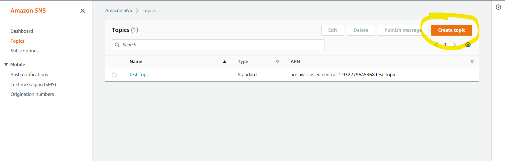
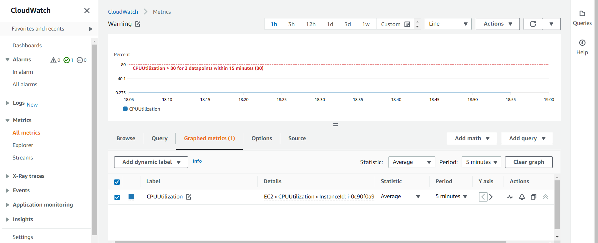
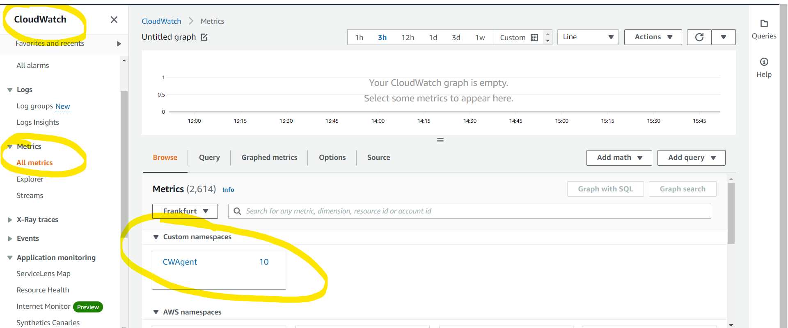
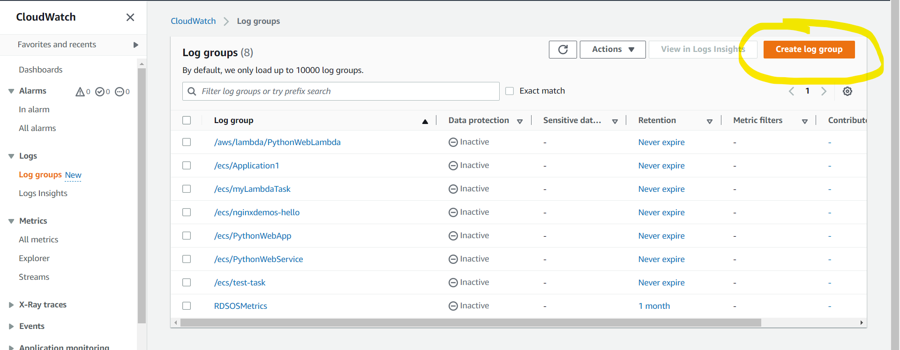

# Task with Using CloudWatch 

### Using CloudWatch for Resource Monitoring, Create CloudWatch Alarms and Dashboards.
- Create EC2 Instance.SSH into EC2 Instance. 
- Create SNS Topic. 
- Subscribe to an SNS Topic. (via email) 
- Check EC2 CPU Utilization Metrics in CloudWatch Metrics. 
- Create CloudWatch Alarm. 
- Testing CloudWatch Alarm by Stressing CPU Utilization. (stress --cpu 2 --timeout 60)
- Checking For an Email from the SNS Topic.
- Checking the CloudWatch Alarm Graph.
- Create a CloudWatch Dashboard. 

Create SNS topic

Subscribe to an SNS Topic. (via email)

Check EC2 CPU Utilization Metrics in CloudWatch Metrics.

Create CloudWatch Alarm. (Select setting which is needed(CPUUtilization, your sns topic))

Note : [Link] : https://docs.aws.amazon.com/AWSEC2/latest/UserGuide/ebs-using-volumes.html

Next connect to ec2 and test it.
Then check the email, you will receive message from AWS.
Check CloudWatch Alarm Graph and create CW Dashboard.

And create CloudWatch Dashboard.

Task ended!

### Don't forget to delete everything you've done.

### Install CloudWatch Logs Agent on EC2 Instance and View CloudWatch Metrics.

- Create an EC2 instance.
- SSH into EC2 Instance.
- Download and Install the Cloudwatch agent on EC2.
- Configure and Start the Agent.
- View the metric in the Cloudwatch Metrics.

Just follow the link:
[Link] : https://jason-6.medium.com/how-to-setup-cloudwatch-agent-on-ec2s-f7de5b2d2b66

Note : Answer on questions!

View the metric

Task ended!

### Don't forget to delete everything you've done.

### Create an Alarm Using a Metric Filter.
- Create an SNS topic.
- Create an email subscription to the topic
- Create a log group and configure the log group to retain logs for 1 year.
- Create a metric filter using the previous log group and name it http-5xx-metric. Create a filter pattern that monitors
all of the HTTP 500-level errors and name it http-5xx-filter. Use these log events to test the pattern you created.
-  Create an alarm using the custom metric filter you just created. Set the metric name to http-5xx-sum.
- Configure the alarm to evaluate every minute and set the total threshold to greater than 5. Then, set the alarm 
threshold to 3 units.
- Publish a message to the topic when the ALARM state is triggered. Set the alarm name to 5xx-alarm.

Create SNS and Subscribe

Create a log group

Create a metric filter, open and test.

And create alarm on it.
