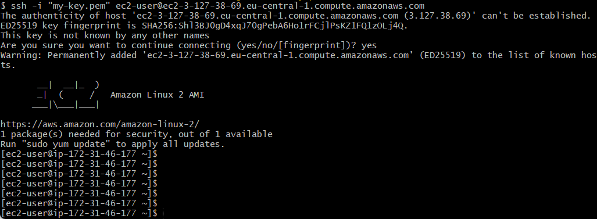
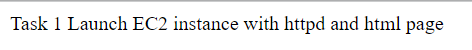

# Tasks with ec2-instance

### Launch internet accessible web server using ec2 with manual setup. Launch ec2 instance, setup web server using httpd and html page, test it via public ip address.

Connect to ec2-instance

Write some commands:

- sudo su
- yum update -y
- yum install httpd -y
- service httpd start
- chkconfig httpd on

And create html file via "nano" command

Enter my Public IPv4 DNS from ec2-instance

And you can see your result

Task ended!