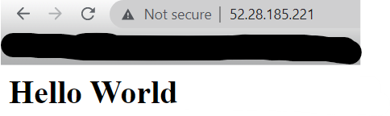
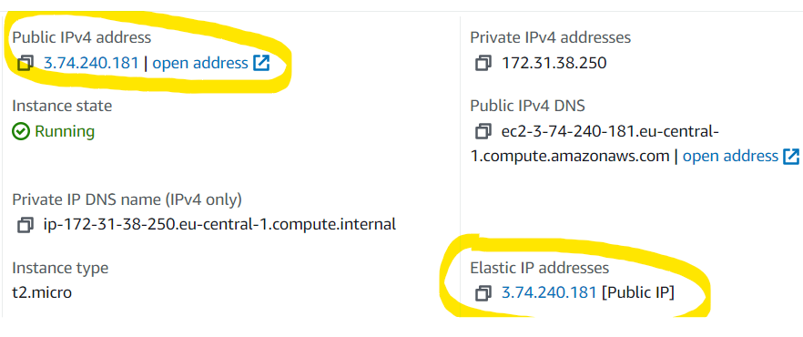
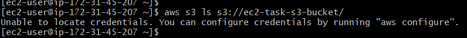
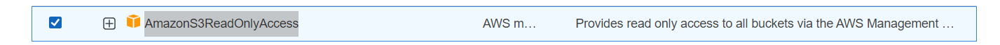
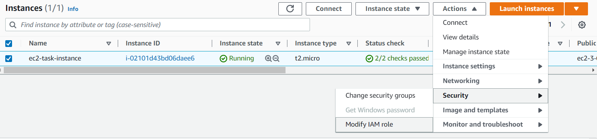
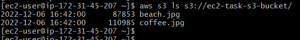
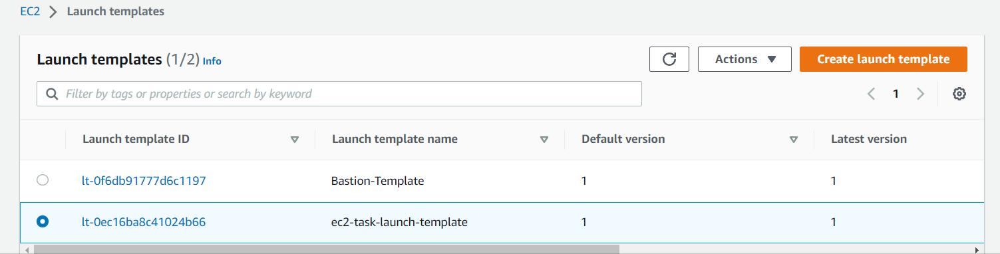
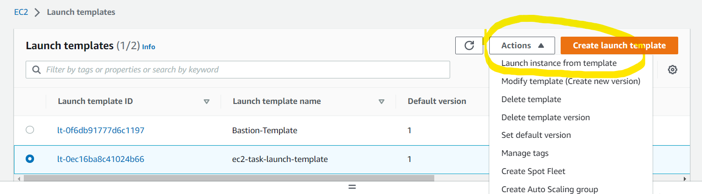

# Tasks with ec2-instance

### 1. Launch internet accessible web server using ec2 with manual setup. Launch ec2 instance, setup web server using httpd and html page, test it via public ip address.

Connect to ec2-instance

Write some commands:

- sudo su
- yum update -y
- yum install httpd -y
- service httpd start
- chkconfig httpd on

And create html file via "nano" command

Enter my Public IPv4 DNS from ec2-instance

And you can see your result

Task ended!

### 2. Setup EC2 using userdata. Automate step 1 using userdata. Do your steps to set up a web server via userdata, test it via a public ip address.

When we want to create ec2 instance with userdata, you need select "Advanced settings" 

Then you need enter your script such as :

/yum update -y

/yum install -y httpd

/systemctl start httpd

/systemctl enable httpd

/echo "(h1 Hello World /h1" > /var/www/html/index.html

#### When your instance is running copy your public IPv4 and past in browser

#### You can see the result

Task ended!

### 3. Setup EC2 using userdata and create a static public ip address. Reproduce previous step, attach elastic ip, reboot instance, test it via elastic ip.

Just create ec2-instance, add the elastic ip, (remember public ip) stop the ec2-instance.
Run instance again.
As you can see with elastic ip our public ip is not changed. Check it in your browser.

### Don't forget to delete everything you've done.

Task ended!

### 4. Create an ec2 server and test access for S3. Create a test s3 bucket (just a simple s3 bucket with full default settings). Create EC2 and try to get a list of S3 buckets in the account. You should get an error, google it and try to understand why. Fix the error using iam role with right iam permissions.

Create ec2-instance as you did it in previous steps. And create s3 bucket.
Next step try to connect to s3 via ec2-instance. You will receive the error

After this, you should give the permissions so that you can connect to s3-bucket.
For this we should create "IAM role"

I`ll join the role : AmazonS3ReadOnlyAccess

When you created the role, next you need to attach this one to your ec2-instance

After this enter command one more time and you can see, you have access to s3-bucket. And you can see my files which I`ve uploaded in my bucket

Task ended!

### Don't forget to delete everything you've done.

### 5. Launch template. Create a Launch template with basic settings and userdata. Test it via public ip.

Click on "Create Launch Template", enter "name", "quick start with AWS", "Instance type - t2.micro", choose your own "Key pair" and "Security groups".
In "Advanced details" enter userdata as you did it in previous tasks.

Then you can see your Template :

Launch ec2-instance from the template and check it.

Enter your public ip and see the result

Task ended!

### Don't forget to delete everything you've done.

 hello 
