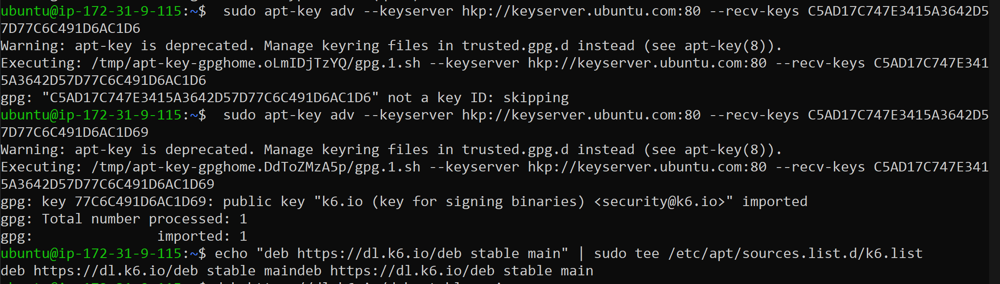
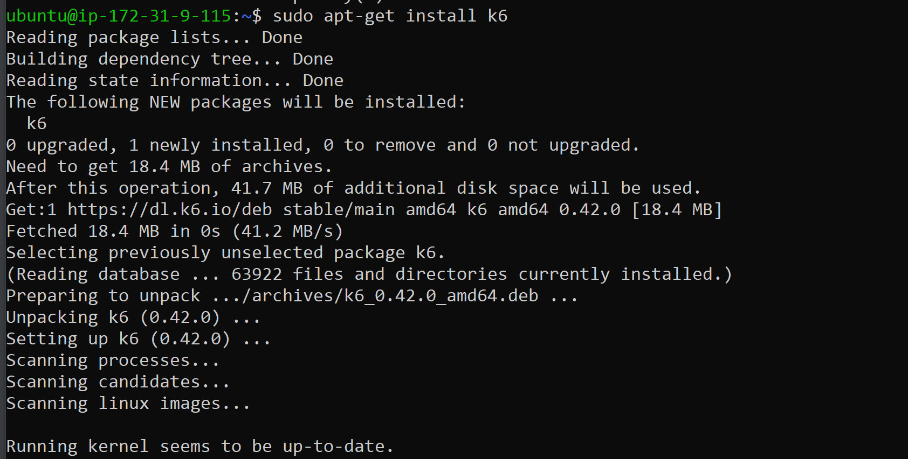
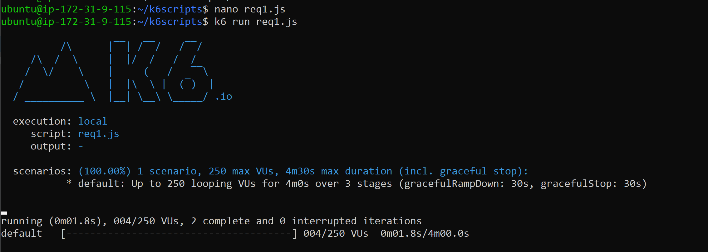

#How to set up K6 on EC2

Firstly, create our instance (Ubuntu 20.04) and connect to it

Next, run:
```
sudo apt-get update

sudo apt-get upgrade

sudo apt-key adv --keyserver hkp://keyserver.ubuntu.com:80 --recv-keys C5AD17C747E3415A3642D57D77C6C491D6AC1D69

echo "deb https://dl.k6.io/deb stable main" | sudo tee /etc/apt/sources.list.d/k6.list
deb https://dl.k6.io/deb stable main

sudo apt-get update
```


This will prepare a background for our k6 installateion and now we canrun

```
sudo apt-get install k6
```
To install it


Next let's create a test script folder:

```
mkdir k6scripts/

cd k6scripts/
```

And create a new file with tests like this:

```
nano req1.js
```
Then paste there everything from [here](source/req1.js) or just copy it to our instance
and add your url that you want to test there

And to check it just run 

```
k6 run req1.js
```

