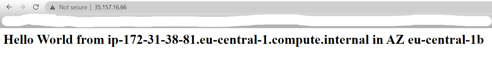
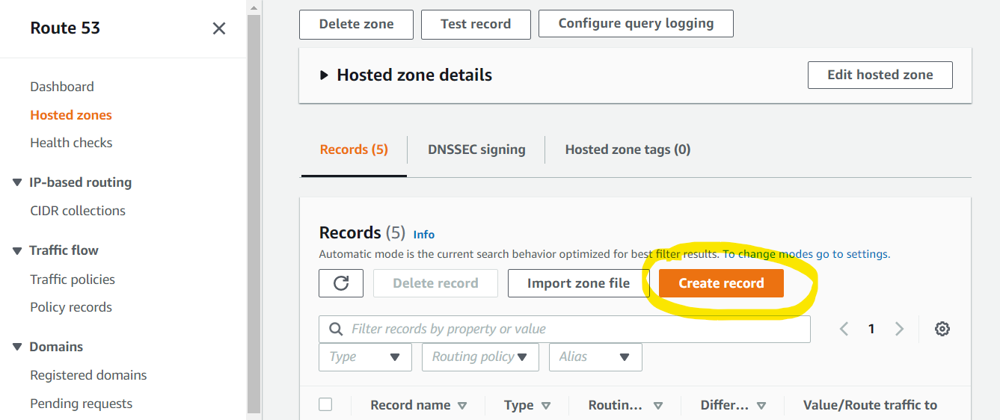
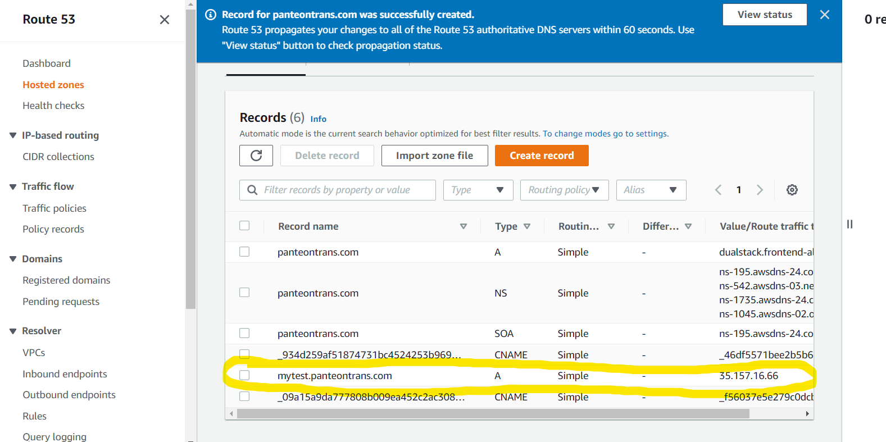

# Tasks with Route 53

### Assign A record for your EC2
- Create ec2 with httpd web server in public subnet.
- Create A record in ec2 for IP address of ec2.
- Test it.

Create our ec2.

Create A record.

Test out record.

Task ended!

### Don't forget to delete everything you've done.

### Alias setup for EC2
- Create ec2 with httpd web server in public subnet.
- Create ALB and target group.
- Create alias for alb.
- Test it.

Task ended!

### Don't forget to delete everything you've done.

### Private hosted zone
- Create a ec2 instance in private subnet.
- Create internal ALB + target group.
- Create private hosted zone and point alias to this ALB.
- Try to call this alias from your browser.
- Create a bastion in the public subnet and try to ping this ec2 using the hosted zone.

Task ended!

### Don't forget to delete everything you've done.