# S3 + CloudFront

So, first lets create our S3 bucket:
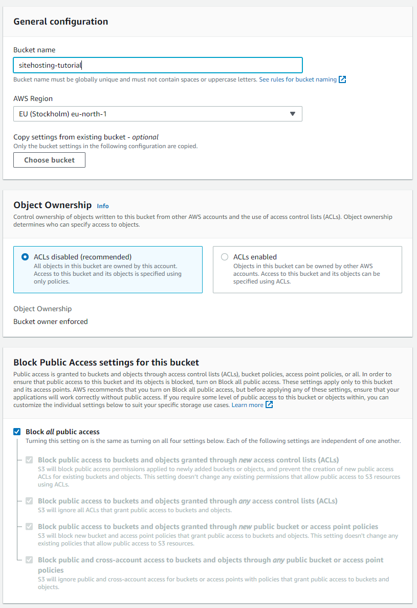
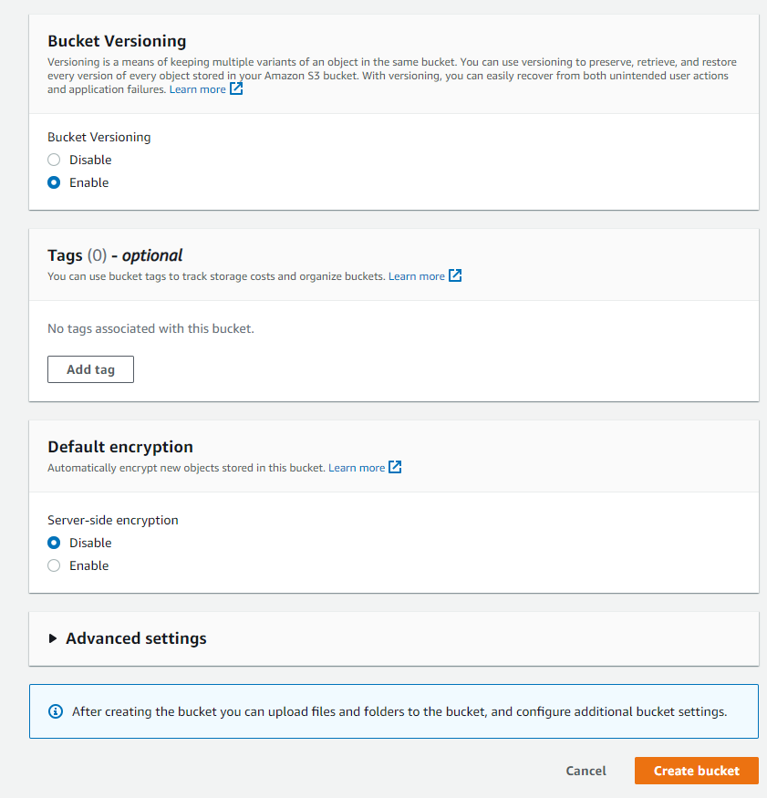

And lets upload here files for our site from [site-resources](../site-sources) package

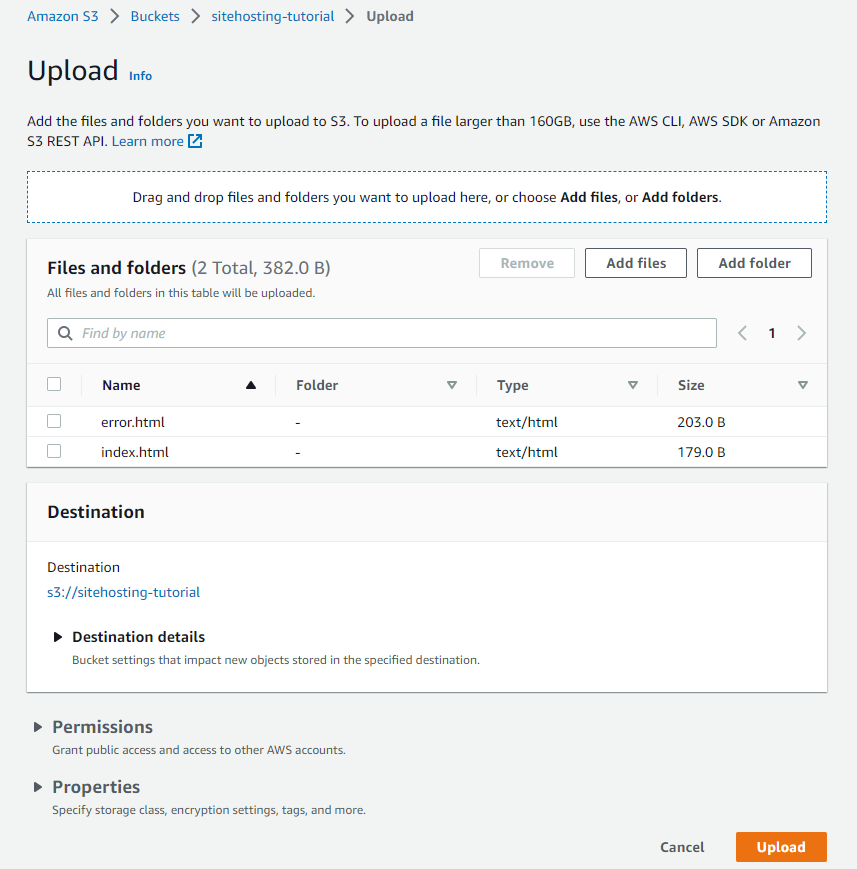

Next go to CloudFront console

Here we have to create a new distribution:
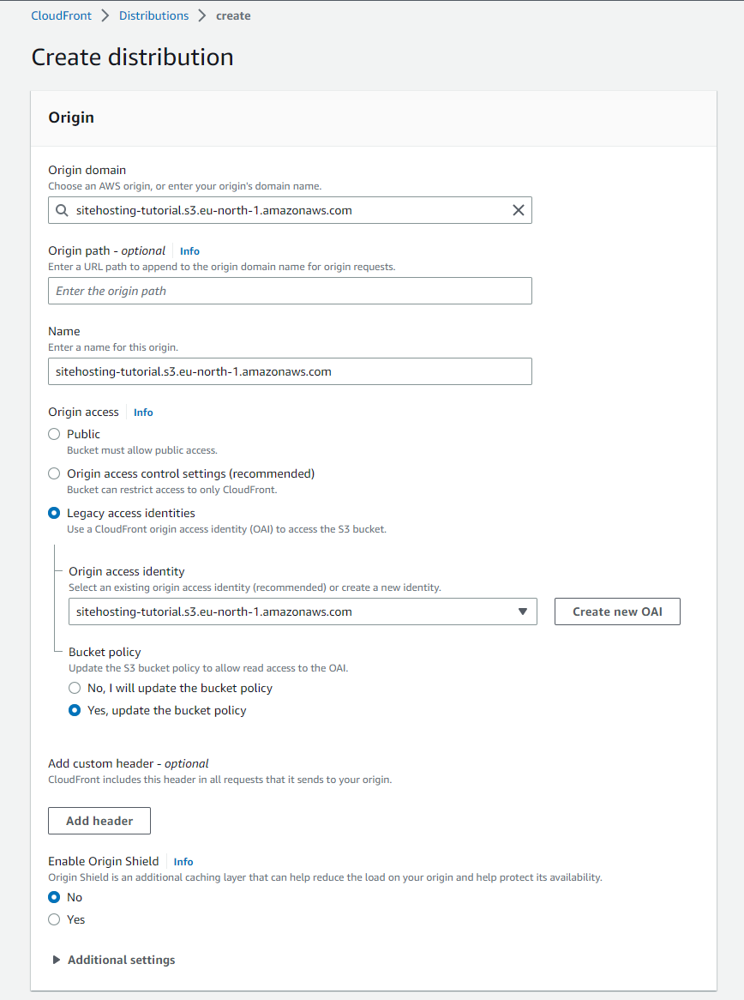
So, we chose our bucket in origin domain and asks CloudFront to create policies needed to access it

For this project other settings can be just default, but we can specify the ***default root object*** which wll be returned if we request the root url

And now we have to wait a few minutes until it will be deployed
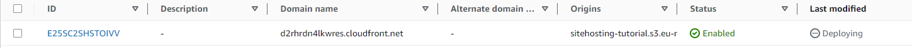

Once it is done we can go back to our Bucket and check bucket policy in permissions,
which gives cloudfront a getObject permission:
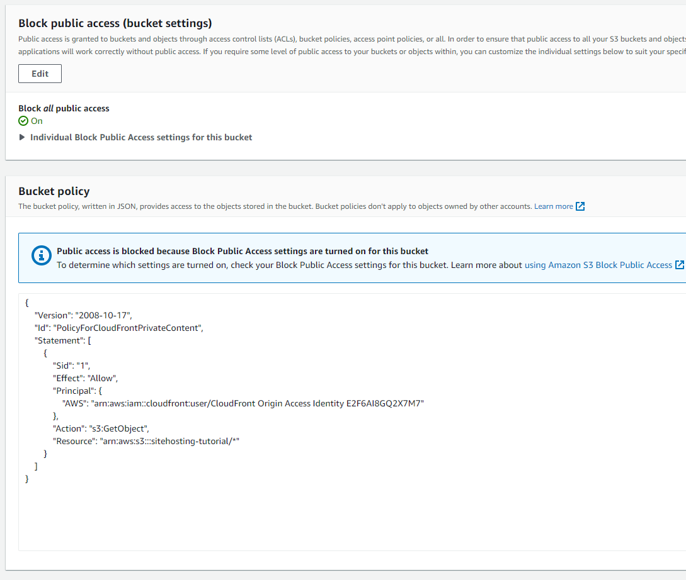
Here we see the id of our CloudFront distribution

And now all we have to do is just put our cloudfront domain and path to file and thats it
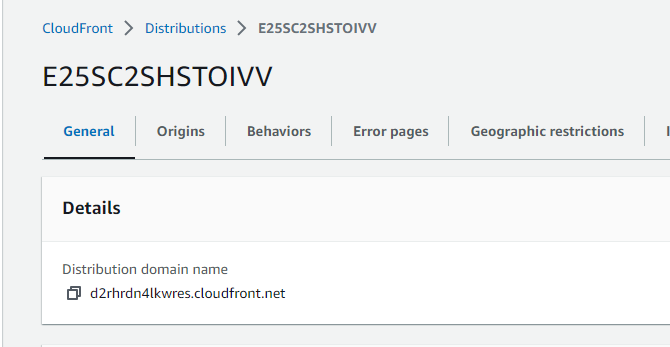
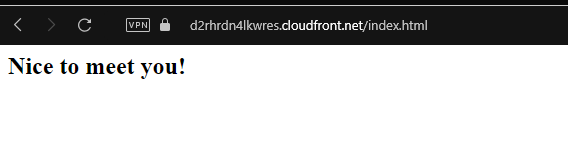

# S3 + CloudFront + WAF

Lets start from creating WAF:
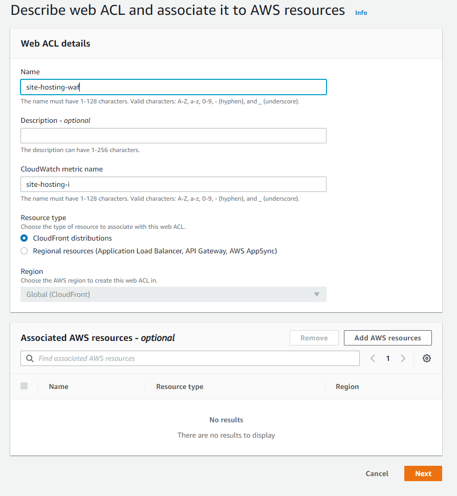

NOTE: if you change region it will reload the page!

Now let's add custom rule that will block any request with 'block-me' in url
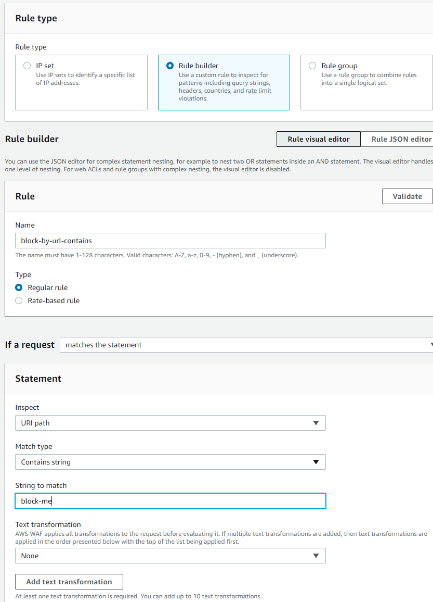
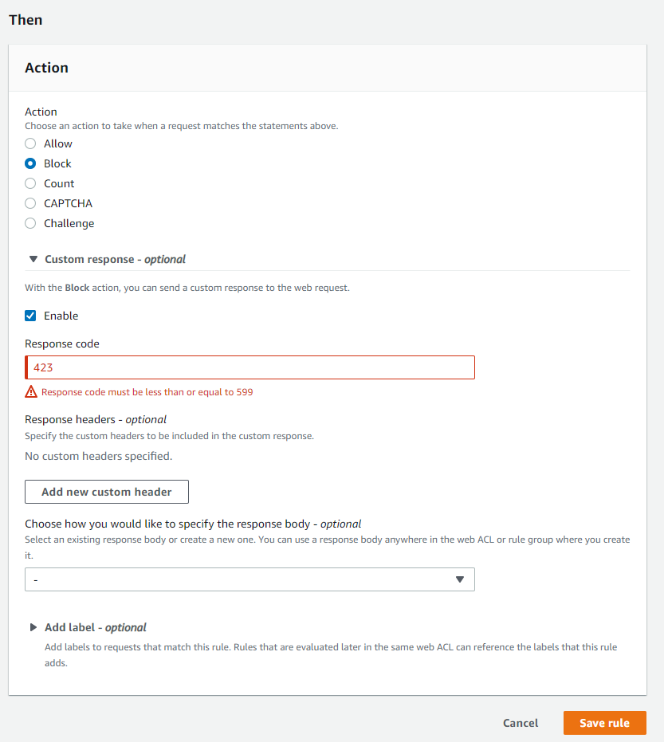
The rest of configurations may be as it is

After this lets create a log group to see our logged data
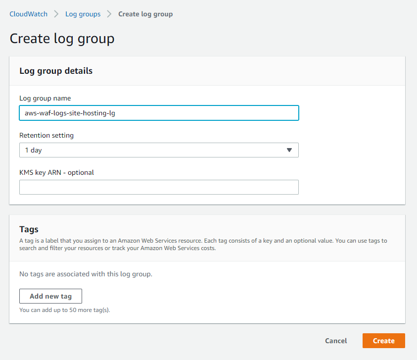
And enable logging in waf 
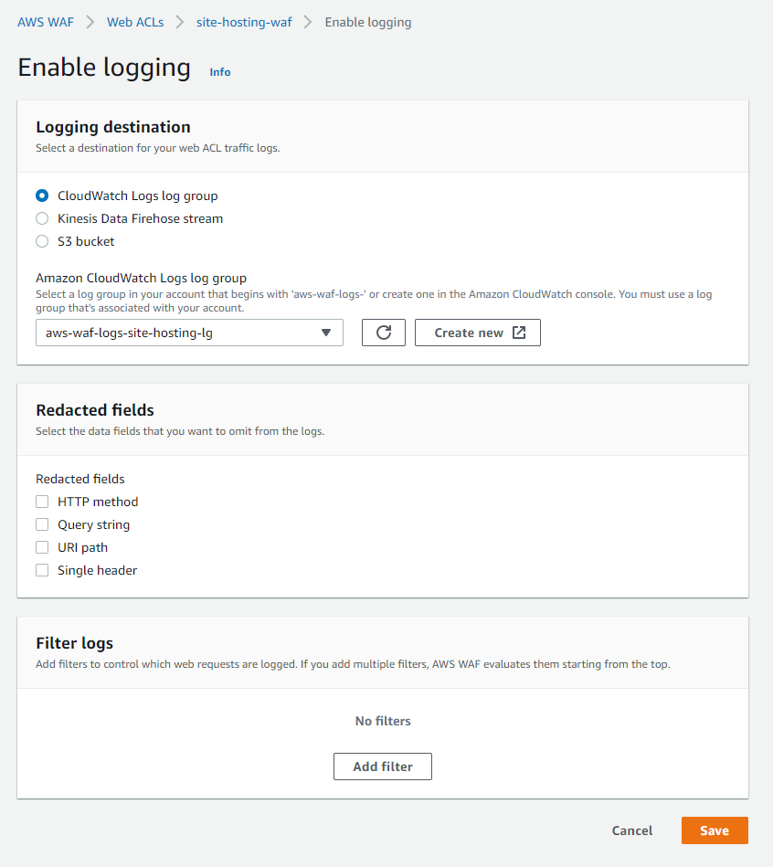
After this lets add our CloudFront to WAF in Associated AWS resources
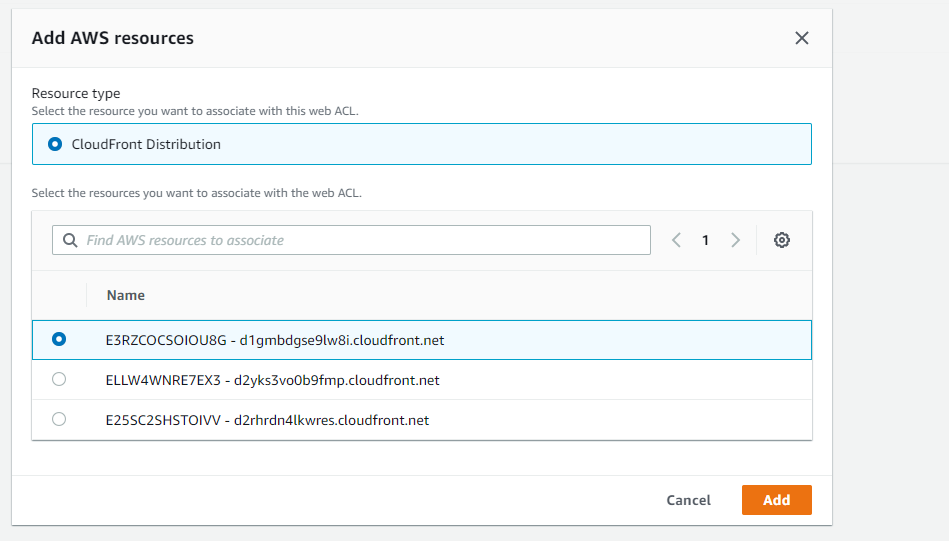
Now we may try to access our site as before and add our string that will be blocked by WAF
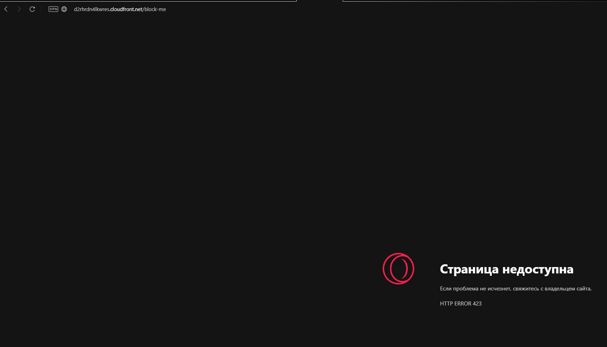

And after this we will see our logs in CloudWatch
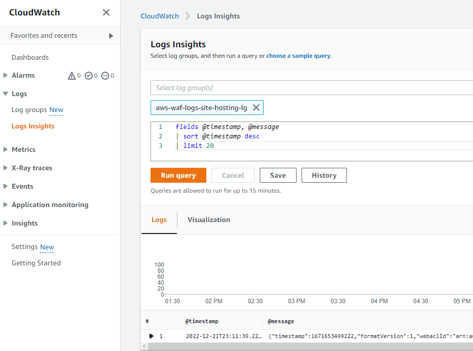