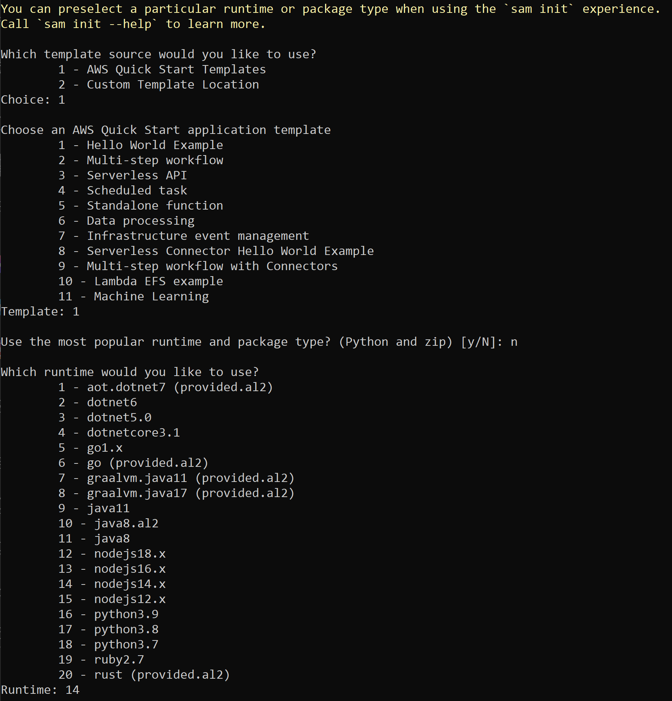
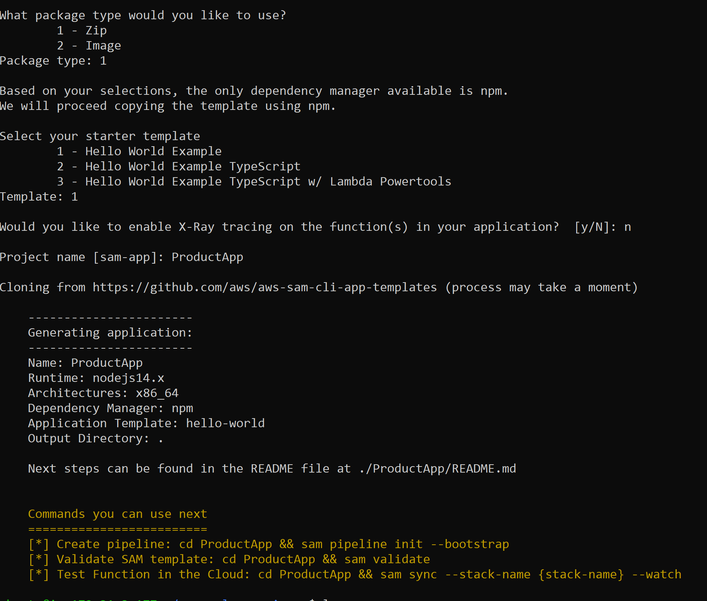
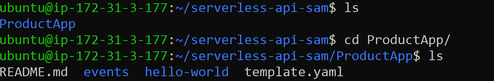
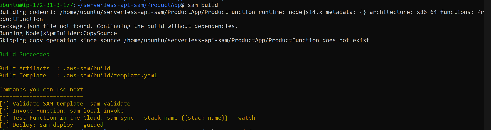
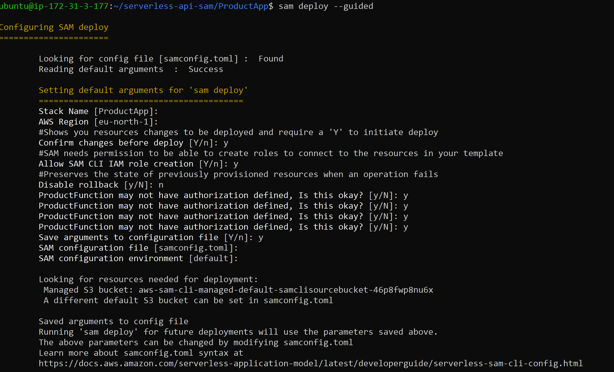
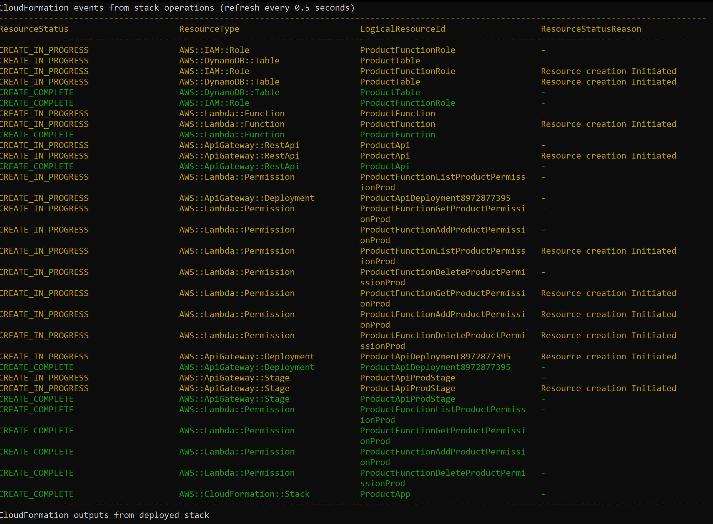

First, lets create our EC2 instance just like before and connect to it

Now, first things first, lets install AWS CLI
```
curl "https://awscli.amazonaws.com/awscli-exe-linux-x86_64.zip" -o "awscliv2.zip"
sudo apt-get install unzip
unzip awscliv2.zip
sudo ./aws/install
```

Now lets install SAM CLI
```
curl -L https://github.com/aws/aws-sam-cli/releases/latest/download/aws-sam-cli-linux-x86_64.zip -o aws-sam-cli-linux-x86_64.zip
unzip aws-sam-cli-linux-x86_64.zip -d sam-installation
sudo ./sam-installation/install
sam --version
```
And as we are going to run it on Python, we need it as well
```
sudo apt install software-properties-common 
sudo add-apt-repository ppa:deadsnakes/ppa 
sudo apt-get install python3.9  
sudo apt-get install python3-pip  
python3 -m pip install --upgrade pip  
sudo apt install python3.9-distutils 
```

Now we need to init our project, let it be simple Hello worl from SAM

```
sam init  
cd sam-app  
```

NOTE: most popular package type is Python3.9, so thats why we need it to be installed

After this lets build it
```
sam build
```


And finally deploy
```
sam deploy --guided
```
For the prompt HelloWorldFunction may not have authorization defined, Is this okay? [y/N], 
AWS SAM is informing you that the sample application configures an API Gateway API without authorization.
When you deploy the sample application, AWS SAM creates a publicly available URL.


#SAM with Dynamodb + Lambda


So, firstly install SAM and boto3 using python:
```
pip install aws-sam-cli
sudo apt-get install boto3
```
Next lets creat folder with our app and init sam there:
```
mkdir serverless-api-sam && cd serverless-api-sam
sam init
```

With the following configurations, as we use node-based lambda:


Now we have an app with template.yaml in there:


Let's modify it with our template

And we have app.js there which we should modify as well

Ater this just build our app:

```
sam build
```


Next, deploy it with the following configuration:


And this is it, everything is setted up and can be checked in AWS:


And finally lets clean up:
```
aws cloudformation delete-stack --stack-name ProductApp
```