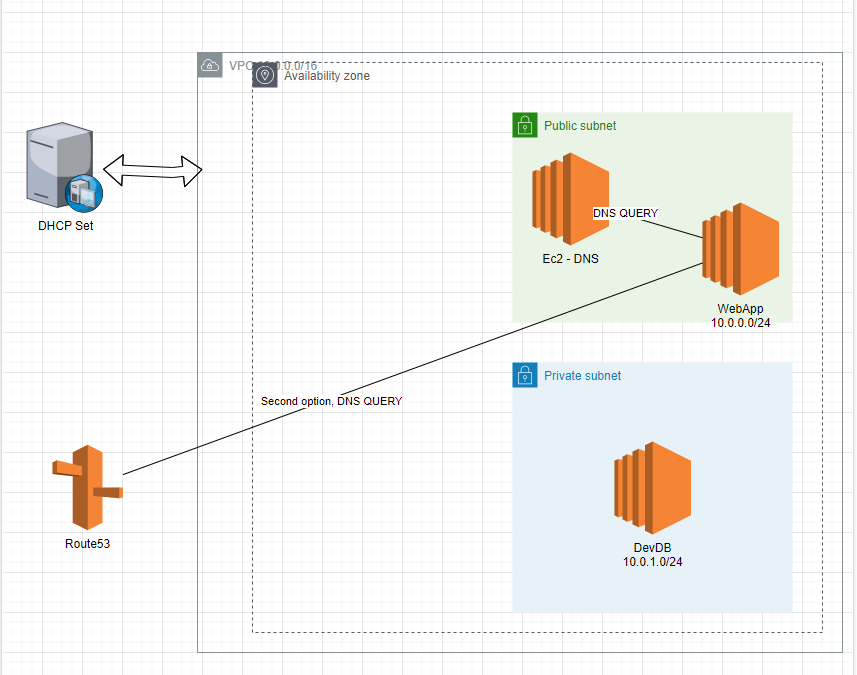
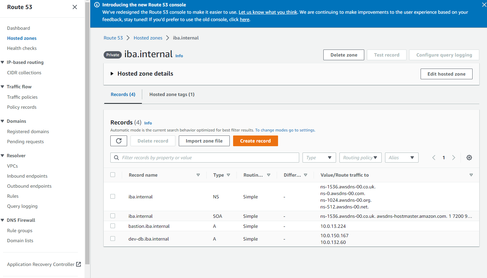
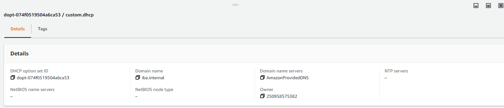
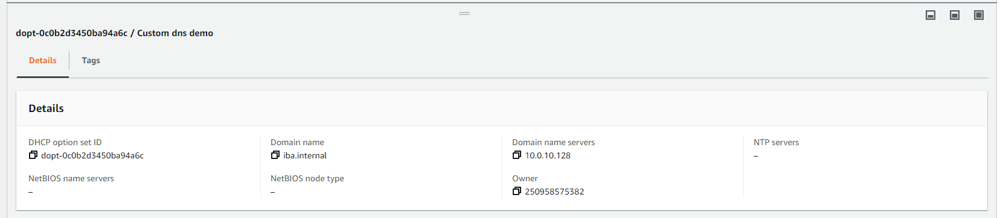

Architecture




Steps for Route53:

* Create VPC with 10.0.0.0/16 sidr
* Create 2 subnets (private 10.0.0.0/24 and public 10.0.10./16)
* Attach internet gateway
* Create instances: One in public subnet called WebApp, SG: allow ssh, ICMP
* Create instances: One in private subnet called DB, SG all ssh, ICMP
* Create Custom DHCP set:
  * Domain name: iba.internal
  * Domain name servers: AmazonProvidedDNS
* Go to route53
* Create Private Hosted Zone (iba.internal)
* Create two records:
  * bastion.iba.internal	A	Simple	-	(private ip) 
  * dev-db.iba.internal	A	Simple	-	(private ip)
* You also can try to create one more network interface and attach it to EC2, than update your route53 record and with nslookup retrieve both ips





Steps for custom dns:

* Create VPC with 10.0.0.0/16 sidr
* Create 2 subnets (private 10.0.0.0/24 and public 10.0.10./16)
* Attach internet gateway
* Create instances: One in public subnet called WebApp, SG: allow ssh, ICMP
* Create instances: One in private subnet called DB, SG all ssh, ICMP
* Create ec2 for DNS in public subnet, SG: allow DNS 53 port
* Create Custom DHCP set:
    * Domain name: iba.internal
    * Domain name servers: private ip address of your DNS ec2
* Then configure dns instance with config below
* Restart all the instances and test the flow

Security group:

* For DNS Ec2 -> DNS 53 should be opened
* For App and DB -> ICMP for ping and SSH



Configure dns server:

1. Login to on-premise DNS server (via SSH into VPN server first)

2. Install DNS server packages

``` sudo su```

```yum update –y```

``` yum install bind bind-utils –y```

3. Create file /var/named/iba.internal.zone [Replace X.X with your App server IP]

```
vim /var/named/iba.internal.zone
```

```
$TTL 86400
@  IN  SOA     ns1.iba.internal. root.iba.internal. (
2013042201  ;Serial
3600        ;Refresh
1800        ;Retry
604800      ;Expire
86400       ;Minimum TTL
)
; Specify our two nameservers
@ IN  NS    dnsA.iba.internal.
@ IN  NS    dnsB.iba.internal.
; Resolve nameserver hostnames to IP, replace with your two droplet IP addresses.
@ dnsA   IN  A   1.1.1.1
@ dnsB    qIN  A   8.8.8.8
; Define hostname -> IP pairs which you wish to resolve
@     IN  A   10.0.x.x
app   IN  A   10.0.x.x
db    IN  A   10.0.x.x
```

4. Create file /etc/named.conf [Replace X.X with your DNS server IP]


```
vim /etc/named.conf
```

```
   options {
   directory "/var/named";
   dump-file "/var/named/data/cache_dump.db";
   statistics-file "/var/named/data/named_stats.txt";
   memstatistics-file "/var/named/data/named_mem_stats.txt";
   allow-query { any; };
   allow-transfer     { localhost; 10.0.x.x; };
   recursion yes;
   forward first;
   forwarders {
   x.x.0.2;
   };
   dnssec-enable yes;
   dnssec-validation yes;
   dnssec-lookaside auto;
   /* Path to ISC DLV key */
   bindkeys-file "/etc/named.iscdlv.key";
   managed-keys-directory "/var/named/dynamic";
   };
   zone "iba.internal" IN {
   type master;
   file "iba.internal.zone";
   allow-update { none; };
   };
```

5. Restart named service

```service named restart```

```  chkconfig named on```